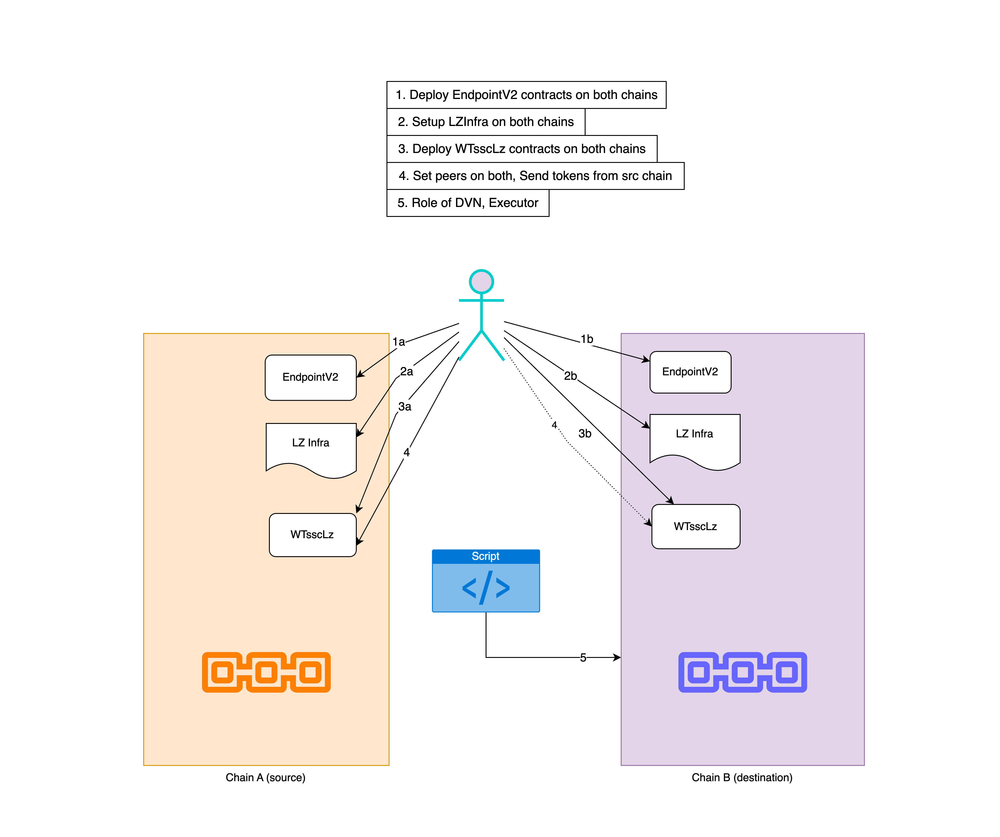

# AutoBridge Demo

## Description



## 1. Deploy EndpointV2 contracts on both chains [OPTIONAL]

Use `script/EndpointV2.s.sol:EndpointV2Script`

> 💡 Step-1 may not be necessary as it could be done in step-2 itself by just deploying a new EndpointV2 contract, especially in cases where the EndpointV2 contract is already being used by many LZ OApp/OFT/ONFT contracts, it's better to start from step-2 so that the existing OApps don't have to call `setPeer` function again.

### Nova

```sh
$ forge script ./script/EndpointV2.s.sol:EndpointV2Script --private-key ${DEPLOYER_PRIVATE_KEY} --rpc-url ${NOVA_RPC_URL} --broadcast  --verify --verifier blockscout --verifier-url $NOVA_VERIFIER_URL --legacy

##### 490000
✅  [Success]Hash: 0x2e8d2463dbbbcc3d45e3d665b1d3c7c04f7c3681aa499a4b401e555f6ca9882f
Contract Address: 0xe7bC84fA427E954Ef0f6E8ed09c13B7a13ac4330
Block: 425231
Paid: 0.0024027835 ETH (4805567 gas * 0.5 gwei)
```

```json
"arguments": [
  "490000",
  "0xB751710Af8Ce68677aB960adB103060f38d09714"
],
```

### Sepolia

```sh
$ forge script ./script/EndpointV2.s.sol:EndpointV2Script --private-key ${DEPLOYER_PRIVATE_KEY} --rpc-url ${SEPOLIA_RPC_URL} --broadcast  --verify --verifier blockscout --verifier-url $ETHSEPOLIA_VERIFIER_URL

##### sepolia
✅  [Success]Hash: 0x0e4209b00ff85fb48aafe61f78f7006b3a087d67e2399a418f511252afff63f9
Contract Address: 0x2BbD672cea0ab55d6d7Db10422D3dDdB4C9498b0
Block: 5767114
Paid: 0.003809066566117655 ETH (4805555 gas * 0.792638221 gwei)
```

```json
"arguments": [
  "40161",
  "0xB751710Af8Ce68677aB960adB103060f38d09714"
],
```

## 2. Setup LZ on both chains

Run LZSetup script: `script/LZSetup.s.sol:LZSetupScript` with already deployed EndpointV2 contracts on both chains in [step-1](#1-deploy-endpointv2-contracts-on-both-chains).

Now, spin up a forked Nova RPC (temporarily for testing) on another open terminal:

```sh
$ anvil --fork-url $NOVA_RPC_URL
Fork
==================
Endpoint:       https://nova-squids.gemini-3h.subspace.network/ws
Block number:   418211
Block hash:     0x3512dd1964165853c68114925d3d7d64158a04dde45538e5d632a15bcda1801a
Chain ID:       490000
```

### Nova

In order to view the arguments used for each tx on forked RPC, refer this file: [lzsetup-nova-run.json](../../deployed-contracts/lz/nova/anvil/lzsetup-nova-run.json) and in order to see all the addresses, refer this file: [lzsetup_addresses_nova.txt](../../deployed-contracts/lz/nova/anvil//lzsetup_addresses_nova.txt).

```sh
# Add EPV2 addresses for both chains in .env
$ source .env
$ forge script ./script/LZSetup.s.sol:LZSetupScript --private-key ${DEPLOYER_PRIVATE_KEY} --rpc-url http://127.0.0.1:8545 --broadcast --legacy
```

<details><summary>Log:</summary>

```sh
==========================

Chain 490000

Estimated gas price: 1.4375 gwei

Estimated total gas used for script: 37858772

Estimated amount required: 0.05442198475 ETH

==========================
##
Sending transactions [0 - 28].
⠒ [00:00:00] [##########################################################################################################>------------------------------------------------] 20/29 txes (0.0s)##
Waiting for receipts.
⠤ [00:00:00] [########################################################################################>--------------------------------------------------------------] 17/29 receipts (0.0s)
##### 490000
✅  [Success]Hash: 0xa77b08a8d1bab21174699f2fe01e1cd45cb164d43a527cc226d4248380fb8b73
Contract Address: 0xD432Cd46524762008cD87c0bcECFAab649a54803
Block: 425361
Paid: 0.0009975344375 ETH (693937 gas * 1.4375 gwei)


##### 490000
✅  [Success]Hash: 0xb47ddfe7f3ddb58168bb5c6662f54b8529f3d31e843088d90eeea2bcec009582
Contract Address: 0x43eB700E3880BEb2622AD143CF50d2cc22c254e9
Block: 425362
Paid: 0.002116974625 ETH (1472678 gas * 1.4375 gwei)


##### 490000
✅  [Success]Hash: 0x9449a69f2c308950cc176a0d6140368f7f813de47c84f5215569e454eea25d57
Contract Address: 0x7063240061be3ABEde39DC3fd0c4CfFEE4061497
Block: 425362
Paid: 0.0059495005625 ETH (4138783 gas * 1.4375 gwei)


##### 490000
✅  [Success]Hash: 0xabbfc41a675bec5ba756a03bc7392cac25876639972b2f2f0e1c670bad0bee99
Contract Address: 0x56Ec18E6cfdf441a39F8b5c7ec9620EEFd12d010
Block: 425362
Paid: 0.003117836875 ETH (2168930 gas * 1.4375 gwei)


##### 490000
✅  [Success]Hash: 0x977bfcf89c19400d7d517c7bce4d6cd0273d794c294e2a27a4ddd1c817f2606e
Block: 425362
Paid: 0.0001121293125 ETH (78003 gas * 1.4375 gwei)


##### 490000
✅  [Success]Hash: 0xe40b70db76bccf83d251efe0ee85cf0d4ab546cb87f9a9fe6ebc85950f6a427f
Block: 425363
Paid: 0.0001121365 ETH (78008 gas * 1.4375 gwei)


##### 490000
✅  [Success]Hash: 0x2fcf3257ef8c1d08ed343b8299af190dea7a41ab43006cebaeaf93183ebca753
Block: 425363
Paid: 0.0001122644375 ETH (78097 gas * 1.4375 gwei)


##### 490000
✅  [Success]Hash: 0x4e2f23332fe34ce781d90dcc3409868da323541c4634f5daa6f00e05a08952bb
Contract Address: 0xA529d218928a801d9A4504d8308D95Ce9792C619
Block: 425364
Paid: 0.003648878125 ETH (2538350 gas * 1.4375 gwei)


##### 490000
✅  [Success]Hash: 0xc7086d5837149899d351818d8540012c85a9af6102f86e999c0cef591fd641af
Contract Address: 0xF602F10dc5Dc741Ed1299841B053948951C1a999
Block: 425364
Paid: 0.000586238375 ETH (407818 gas * 1.4375 gwei)


##### 490000
✅  [Success]Hash: 0xb3d715754c939f127de9b3756bf0730bb75cc0bdc0ab65775465aeedcd660a8a
Contract Address: 0xee48C0F142043A4BA4FF8E1f8df3196ce16817C5
Block: 425364
Paid: 0.000429295 ETH (298640 gas * 1.4375 gwei)


##### 490000
✅  [Success]Hash: 0xeb6d5967f248d0c7ad077e030321d94513b9b502b228401dfa29cd3731f457de
Contract Address: 0x31f9F1Ff259bE6f27d8C3B0ccb30f04dfd647D28
Block: 425365
Paid: 0.0058976039375 ETH (4102681 gas * 1.4375 gwei)


##### 490000
✅  [Success]Hash: 0x0ee3d3aa13af93dc6c9cd16c0bb3125a16c08cdae9a7a1dd992c3432438d3e09
Contract Address: 0xAC0D7A92aE0Ca899B5adfCcbf3d5b5C8a121DffC
Block: 425365
Paid: 0.0036425258125 ETH (2533931 gas * 1.4375 gwei)


##### 490000
✅  [Success]Hash: 0x311b9c6931a2744c7ff51c145fe8a2062ead81978f616227996b3ba2072f4b27
Contract Address: 0xd3242Fe2085d3D7dC73De281D4c834EEA61447C6
Block: 425365
Paid: 0.0018807401875 ETH (1308341 gas * 1.4375 gwei)


##### 490000
✅  [Success]Hash: 0x9259c30fcb7854bd4ccd36abba4f70f8e32bc826d83ff33515c450ebd00da12d
Block: 425365
Paid: 0.000227909875 ETH (158546 gas * 1.4375 gwei)


##### 490000
✅  [Success]Hash: 0xbe79480cc737db2df73f02d74b48718558a352f04747da7bd78d7bc95224b100
Contract Address: 0x7e1C189a05Cc36AD671D3665c2f6351931841779
Block: 425366
Paid: 0.004759898875 ETH (3311234 gas * 1.4375 gwei)


##### 490000
✅  [Success]Hash: 0xefcbce8b66b3907be53af0ef443deece48788bf9031ba6ae1ede2be1707f6f87
Block: 425367
Paid: 0.000073508 ETH (51136 gas * 1.4375 gwei)


##### 490000
✅  [Success]Hash: 0xc26c39c87627ea44121975069c420dfff393db0f0c6110584259831dc09ad7ed
Contract Address: 0xefcC10b4E00eb7a587c6e9bA0d418FcA4776435b
Block: 425367
Paid: 0.0012661385 ETH (880792 gas * 1.4375 gwei)


##### 490000
✅  [Success]Hash: 0xf975f3b7b3ba9c6d853b407776b4ef2ce43ce4834d28f002acb3a105a27076ff
Block: 425367
Paid: 0.0000436439375 ETH (30361 gas * 1.4375 gwei)


##### 490000
✅  [Success]Hash: 0x719cabdb0929be9a4c8cfa82022071de9256183938f62b57bf7c045eded3a1a1
Block: 425367
Paid: 0.0000433219375 ETH (30137 gas * 1.4375 gwei)


##### 490000
✅  [Success]Hash: 0x95826b3ab709fea71814159d8f6f6c9e3dd154220afc90a1b7d461c28f44ba6b
Contract Address: 0x2aA3289C9aaBB049408F2671a48DB006DdE01fA0
Block: 425367
Paid: 0.003980676125 ETH (2769166 gas * 1.4375 gwei)


##### 490000
✅  [Success]Hash: 0x1bd4efcffa9110b6605d72a2426bab6b694d96341868fb8f50074f1dc0ad20e8
Contract Address: 0xc860046377C5Dfe437501691712Ac7bAdf3A490d
Block: 425367
Paid: 0.0015614771875 ETH (1086245 gas * 1.4375 gwei)


##### 490000
✅  [Success]Hash: 0x0a1dee32b7ef3b0e12c7c30eba0a146377453ba6669086fc6c733d72b6977dc6
Block: 425368
Paid: 0.0004520376875 ETH (314461 gas * 1.4375 gwei)


##### 490000
✅  [Success]Hash: 0x2a6bd9ef38063236cfc2d6041142e1f473bac1e9be6021939d6883a2815e1e1c
Block: 425368
Paid: 0.000043599375 ETH (30330 gas * 1.4375 gwei)


##### 490000
✅  [Success]Hash: 0x9f0ef52cdd50b01a953777db24bc2e1fbee668a4b01ff83fc6d3a996973f0263
Block: 425368
Paid: 0.00010608175 ETH (73796 gas * 1.4375 gwei)


##### 490000
✅  [Success]Hash: 0x886a76486c1a7f2309d58dea33a6189ae81e231327d560e6d8dd3dd03a946885
Block: 425368
Paid: 0.0000727446875 ETH (50605 gas * 1.4375 gwei)


##### 490000
✅  [Success]Hash: 0xd4d4b39c2f8a8babb86af18de244db99d8474327b8d5f3ce29a0aeaa62971c5f
Block: 425368
Paid: 0.0001541675625 ETH (107247 gas * 1.4375 gwei)


##### 490000
✅  [Success]Hash: 0x73db4594403aa21a808d665b074b4b946b4d615af902ecced2f1a0a544939240
Block: 425368
Paid: 0.00015401375 ETH (107140 gas * 1.4375 gwei)


##### 490000
✅  [Success]Hash: 0xfae6df0805accf57cc964d844a25929101d3ed8c8860612d9e49ff005a46be32
Block: 425368
Paid: 0.0000814185625 ETH (56639 gas * 1.4375 gwei)


##### 490000
✅  [Success]Hash: 0x652709ba6f796df8c568283bc502fe488b1e9e2b668291c86de77ef7bea52b75
Block: 425370
Paid: 0.0000907393125 ETH (63123 gas * 1.4375 gwei)


==========================

ONCHAIN EXECUTION COMPLETE & SUCCESSFUL.
Total Paid: 0.0417150353125 ETH (29019155 gas * avg 1.4375 gwei)
```

</details>

### Sepolia

In order to view the arguments used for each tx on forked RPC, refer this file: [lzsetup-sepolia-run.json](../../deployed-contracts/lz/sepolia/lzsetup-sepolia-run.json) and in order to see all the addresses, refer this file: [lzsetup_addresses_sepolia.txt](../../deployed-contracts/lz/sepolia/lzsetup_addresses_sepolia.txt)

```sh
forge script ./script/LZSetup.s.sol:LZSetupScript --private-key ${DEPLOYER_PRIVATE_KEY} --rpc-url ${SEPOLIA_RPC_URL} --broadcast  --verify --verifier blockscout --verifier-url $ETHSEPOLIA_VERIFIER_URL
```

<details><summary>Log:</summary>

```sh
==========================
##### sepolia
✅  [Success]Hash: 0xbf2eae8b2b275b9c9b0a31f3ce7f29ddc5e05577e22565f267a663672b656954
Contract Address: 0x4D21140767E470d0b6338957455EBEc147849a2d
Block: 5767127
Paid: 0.000576155911959833 ETH (693937 gas * 0.830271209 gwei)


##### sepolia
✅  [Success]Hash: 0xee29021b1a8887706baabf9e8399ef0f29ae41dc4b7ced31b98fe0fbf5a95918
Contract Address: 0x07Ae3dec66d8E8502Ff8A2fa7547C0d34CB6C365
Block: 5767127
Paid: 0.00122273210678221 ETH (1472690 gas * 0.830271209 gwei)


##### sepolia
✅  [Success]Hash: 0x8c64a4f14a150b55b54e1eaab001137f85c60b5c33d2ee208c2e5d6f5cc9d536
Contract Address: 0x4426F0ac7cf036b377B16376b338dd62C06573e1
Block: 5767127
Paid: 0.003436312365198647 ETH (4138783 gas * 0.830271209 gwei)


##### sepolia
✅  [Success]Hash: 0x20ad8bf1112fa2019ec6d55f643767d524a1530d2550cd17bd4bf19753e1a688
Contract Address: 0xC680243758F10a6dc5237B155ed67b82E4A3e5C0
Block: 5767127
Paid: 0.00180080013333637 ETH (2168930 gas * 0.830271209 gwei)


##### sepolia
✅  [Success]Hash: 0x3c7f41095206c797dc9c5b0d36d51d8493d8c34e1f51a6d52562c89404365bab
Block: 5767127
Paid: 0.000064763645115627 ETH (78003 gas * 0.830271209 gwei)


##### sepolia
✅  [Success]Hash: 0x6e025b8a3fc3f485bf7d6b294ecfc9b770dcc8323f94d1c3c7de6addb11cdd05
Block: 5767127
Paid: 0.00006477775972618 ETH (78020 gas * 0.830271209 gwei)


##### sepolia
✅  [Success]Hash: 0xe42038dc6d7952c74f06b59d205f46569fb050ca74075adadf76940b791a85b0
Block: 5767127
Paid: 0.000064841690609273 ETH (78097 gas * 0.830271209 gwei)


##### sepolia
✅  [Success]Hash: 0x373869c36fb57f76877713f2476632630159293760205e38d87c65b1b57de8d6
Contract Address: 0x838080DFefBafa6d09A0a1f6bA76705090b70Ac4
Block: 5767127
Paid: 0.00210751892336515 ETH (2538350 gas * 0.830271209 gwei)


##### sepolia
✅  [Success]Hash: 0xd703b92337839be00481bdb7888bea04110ad4071e170302c2db131e4a42a66e
Contract Address: 0xCDba54b7c687D434D105687fD43b37890bD5771c
Block: 5767127
Paid: 0.000338599543911962 ETH (407818 gas * 0.830271209 gwei)


##### sepolia
✅  [Success]Hash: 0xcd21fafdee41505016021787be80bfcd4035acaadd73ddffc59682b210e5aa4a
Contract Address: 0x9DcbEbFb3294FdE19E427FBb6361A3594443b780
Block: 5767127
Paid: 0.00024795219385576 ETH (298640 gas * 0.830271209 gwei)


##### sepolia
✅  [Success]Hash: 0x8809017bf9972844994abe54f25d04ba00504adb49739c8edb69bfa5f914038b
Contract Address: 0xD2318f102fF1216355641e851D973843A783b0D2
Block: 5767127
Paid: 0.003406327950756821 ETH (4102669 gas * 0.830271209 gwei)


##### sepolia
✅  [Success]Hash: 0xa43197b222aca973a95105822ddb239c9aa423a698111b48f8f03a072e607962
Contract Address: 0x9C80088Cc4e57430810603309769cc448Cd5Ceb9
Block: 5767133
Paid: 0.002103843042476547 ETH (2533919 gas * 0.830272413 gwei)


##### sepolia
✅  [Success]Hash: 0x5fc01c17c576c78a25ba0b9bb195cfb85e4e329988623280386c19fe103fa2af
Contract Address: 0xD05060eD743aA5328a1499cA269C7D1Ec235837e
Block: 5767134
Paid: 0.001086281124240041 ETH (1308341 gas * 0.830273701 gwei)


##### sepolia
✅  [Success]Hash: 0xc958cf7078ddb70bc039e9c0afcaec71bfa43fcc8dd37388c07775d32de09e81
Block: 5767134
Paid: 0.000131636574198746 ETH (158546 gas * 0.830273701 gwei)


##### sepolia
✅  [Success]Hash: 0x534250914c2738e5ba85f1f13a792c95ade3cd432e2b8a055c09834827e3aeed
Contract Address: 0x70b98b8011Cf7DA5aaAEfAF29022d25F9F563c8F
Block: 5767134
Paid: 0.002749230508057034 ETH (3311234 gas * 0.830273701 gwei)


##### sepolia
✅  [Success]Hash: 0x4e65334edb929ce4204f9080214cce7a589d01b7ab2816f9b04bd6144cc6de55
Block: 5767134
Paid: 0.000042466839258748 ETH (51148 gas * 0.830273701 gwei)


##### sepolia
✅  [Success]Hash: 0x7d73535cf4cce3630cc8b0d17415455a5a99c5f87aaaf852dcbcd811f976f151
Contract Address: 0x31C463a40DcCE3d729B4e09c3276d61D5793d349
Block: 5767134
Paid: 0.000731298433651192 ETH (880792 gas * 0.830273701 gwei)


##### sepolia
✅  [Success]Hash: 0x005a278b335daef2d244ec5b0c922d268ac5111da8d1bb119aa69595f414afec
Block: 5767134
Paid: 0.000025207939836061 ETH (30361 gas * 0.830273701 gwei)


##### sepolia
✅  [Success]Hash: 0x05b9ec46bebf8a3903ddb4b07bd9497c9ea60a93f4289e55aaf1efa800f6d7c0
Block: 5767134
Paid: 0.000025021958527037 ETH (30137 gas * 0.830273701 gwei)


##### sepolia
✅  [Success]Hash: 0xf20b734cd7dbca1baae6efea843c43596899e46696571c139aa6f7383c336eac
Contract Address: 0xF83aD3B155d734C98c010154cD6309Ae1a8219A8
Block: 5767144
Paid: 0.002299186818394116 ETH (2769166 gas * 0.830281326 gwei)


##### sepolia
✅  [Success]Hash: 0x52cb51294164c12162f6efa529ee50eef00e6908b152a0abecb7b1b58b5c656b
Contract Address: 0x3B2B740e15360C27565422c6fbEaEAaf8c10031e
Block: 5767144
Paid: 0.00090188893896087 ETH (1086245 gas * 0.830281326 gwei)


##### sepolia
✅  [Success]Hash: 0x5f147e4a38731c37a9860499c657faa4f1dd20a0a25ca957379e6958d2a9a7a8
Block: 5767144
Paid: 0.000261101059431198 ETH (314473 gas * 0.830281326 gwei)


##### sepolia
✅  [Success]Hash: 0xf73a530307f05aba260c04e869eeb6b37cee67b29441880aebc8119b48a552c4
Block: 5767144
Paid: 0.00002518243261758 ETH (30330 gas * 0.830281326 gwei)


##### sepolia
✅  [Success]Hash: 0x51130f78139232c8edc16a0597e6dc74f2532205766a275222e4fe8c3e137bbc
Block: 5767144
Paid: 0.000061281404109408 ETH (73808 gas * 0.830281326 gwei)


##### sepolia
✅  [Success]Hash: 0xd36936744293b0c8842185d1da1bc1c68cf9b674c5145e941162c4bae2dd0034
Block: 5767144
Paid: 0.000042026349878142 ETH (50617 gas * 0.830281326 gwei)


##### sepolia
✅  [Success]Hash: 0x4e15fbbed919e0c8417669a761f52eb52c6d1c973b343e7c4bb7954a04a6ab0d
Block: 5767144
Paid: 0.000089055144745434 ETH (107259 gas * 0.830281326 gwei)


##### sepolia
✅  [Success]Hash: 0x45c2e908d2dcb5e97bacfbc8996f09812361a05693b78776d19cce17b6a81891
Block: 5767144
Paid: 0.000088966304643552 ETH (107152 gas * 0.830281326 gwei)


##### sepolia
✅  [Success]Hash: 0xe7422903ba208fdfcdc01ebc45b89b2d14a4ae1fcb170e5a6671c4c7d4472b7a
Block: 5767144
Paid: 0.000047046230775138 ETH (56663 gas * 0.830281326 gwei)


##### sepolia
✅  [Success]Hash: 0xc3bc2d2592a883349851f5d3f91443be6100800129669abf761fa3263bb04c84
Block: 5767144
Paid: 0.00005241981151701 ETH (63135 gas * 0.830281326 gwei)


==========================

ONCHAIN EXECUTION COMPLETE & SUCCESSFUL.
Total Paid: 0.024093923139935687 ETH (29019263 gas * avg 0.83027534 gwei)
```

</details>

## 3. Deploy WTsscLz contracts on both chains

Use `script/WTsscLz.s.sol:WTsscLzScript`.

### Nova

```sh
$ forge script script/WTsscLz.s.sol:WTsscLzScript --rpc-url http://127.0.0.1:8545 --private-key $DEPLOYER_PRIVATE_KEY --broadcast --verify --verifier blockscout --verifier-url $NOVA_VERIFIER_URL --legacy

##### 490000
✅  [Success]Hash: 0xab3aa0611d9f75976b91e37a1ed524ded6773c6a6898b0be7aeb8d0d72e6fd76
Contract Address: 0xFe4430822f79B1Fb24F67593df68947de6A96B28
Block: 425371
Paid: 0.003439708539400644 ETH (3084676 gas * 1.115095569 gwei)
```

```json
"arguments": [
    "\"Wrapped Subspace Token\"",
    "\"WTSSC\"",
    "0xe7bC84fA427E954Ef0f6E8ed09c13B7a13ac4330",
    "0xB751710Af8Ce68677aB960adB103060f38d09714"    
],
```

### Sepolia

```sh
$ forge script script/WTsscLz.s.sol:WTsscLzScript --rpc-url $SEPOLIA_RPC_URL --private-key $DEPLOYER_PRIVATE_KEY --broadcast --verify --verifier blockscout --verifier-url $ETHSEPOLIA_VERIFIER_URL

##### sepolia
✅  [Success]Hash: 0xc1bed6e3c6027f7bb089fd90cf756484ef7f3c934a33e407675dd1505756eba0
Contract Address: 0xcfE0A0163B7f5bcEA14e7BEb4Da1fe1A2136F5FF
Block: 5768010
Paid: 0.00362947483329298 ETH (3084676 gas * 1.176614605 gwei)
```

```json
"arguments": [
    "\"Wrapped Subspace Token\"",
    "\"WTSSC\"",
    "0x2BbD672cea0ab55d6d7Db10422D3dDdB4C9498b0",
    "0xB751710Af8Ce68677aB960adB103060f38d09714"
],
```

## 4. Init & Send tokens from src chain

Run AutoBridgeDemo script: `script/lz/AutoBridgeDemo.s.sol:AutoBridgeDemoScript` mainly on src chain to send tokens to dst chain.

> The destination chain is mainly for setting peers.

1. set peers on both sides, if not/incorrectly set. Try to use TS script for this unless you want to debug using Solidity.

    Arguments for Nova:

    | Name | Type | Data
    | --| -- | -- |
    | _eid | uint32 | 40161 |
    | _peer | bytes32 | 0x0000000000000000000000001ae29d803707aa8154aa82c4eb4eff8401a1b94b |

    Arguments for Sepolia:

    | Name | Type | Data
    | --| -- | -- |
    | _eid | uint32 | 490000 |
    | _peer | bytes32 | 0x71a8a8fa7fba2e5f74d58dcb567ce87c46cceea60000000000000000000 |

```sh
$ bun auto-bridge:demo init
$ tsc && node dist/demos/src/auto-bridge/index.js init
Incorrect/No peer was set on Nova.
    So, correct peer set on Nova via tx hash: 0xe84d6760fd409d154e9061c6ea6e1a07932cf4befa5aa8a3f8fcb271533ad037 in block #467929
Incorrect/No peer was set on Sepolia.
    So, correct peer set on Sepolia via tx hash: 0x38c5b44af9527417541ad1dc85dfd1cf3c72bdf7aff03e8b5b0e34c4ca609433 in block #5803754
```

> This is done only once during 1st run.

2. `quoteSend`: get quote for sending tokens from src side.
3. `send`: send tokens from src side

Result of TS script is same as expected from Solidity script 🎉.

To send tokens:

```sh
❯ bun auto-bridge:demo send
$ tsc && node dist/demos/src/auto-bridge/index.js send
📥 Deposited 0.01 TSSC
   - Transaction Hash: 0x974ee807b0ba0a066ff65a25f484c7edd0d474898e730a2a59b663e48c8def57
   - Block Number: #425458
📤 Sending 0.01 wTSSC
   - Contract: '0xFe44...6B28'
   - Transaction Hash: 0x91aa48a89bc089260f49f3777940a4508ceec977c781470f3b10211358e5c480
```

To view total supply of the tokens and balance of the sender (admin in this case):

```sh
bun auto-bridge:demo view
$ tsc && node dist/demos/src/auto-bridge/index.js view
=====================================================
🪙 Token[0] - Total Supply: 0.0 wTSSC
🪙 Token[1] - Total Supply: 0.42 wTSSC
=====================================================
Address '0xB751...9714' with 🪙 Token-[0] balance: 0.0 wTSSC
Address '0xB751...9714' with 🪙 Token-[1] balance: 0.42 wTSSC
```

<details><summary>Here is the Solidity log for reference:</summary>

```sh
forge script ./script/lz/AutoBridgeDemo.s.sol:AutoBridgeDemoScript --private-key ${DEPLOYER_PRIVATE_KEY} --rpc-url http://127.0.0.1:8545 --broadcast --legacy -vvvv
[⠒] Compiling...
No files changed, compilation skipped
Traces:
  [230254] AutoBridgeDemoScript::run()
    ├─ [0] VM::startBroadcast(0xB751710Af8Ce68677aB960adB103060f38d09714)
    │   └─ ← [Return] 
    ├─ [2619] 0xFe4430822f79B1Fb24F67593df68947de6A96B28::isPeer(40161 [4.016e4], 0x000000000000000000000000cfe0a0163b7f5bcea14e7beb4da1fe1a2136f5ff) [staticcall]
    │   └─ ← [Return] true
    ├─ [2664] 0xFe4430822f79B1Fb24F67593df68947de6A96B28::balanceOf(0xB751710Af8Ce68677aB960adB103060f38d09714) [staticcall]
    │   └─ ← [Return] 0
    ├─ [0] console::log("===Before deposit:") [staticcall]
    │   └─ ← [Stop] 
    ├─ [0] console::log("\tWTSSC Balance: ", 0) [staticcall]
    │   └─ ← [Stop] 
    ├─ [45874] 0xFe4430822f79B1Fb24F67593df68947de6A96B28::deposit{value: 10000000000000000}()
    │   ├─ emit Transfer(from: 0x0000000000000000000000000000000000000000, to: 0xB751710Af8Ce68677aB960adB103060f38d09714, value: 10000000000000000 [1e16])
    │   ├─ emit Deposit(from: 0xB751710Af8Ce68677aB960adB103060f38d09714, amount: 10000000000000000 [1e16])
    │   └─ ← [Stop] 
    ├─ [0] console::log("===After deposit:") [staticcall]
    │   └─ ← [Stop] 
    ├─ [664] 0xFe4430822f79B1Fb24F67593df68947de6A96B28::balanceOf(0xB751710Af8Ce68677aB960adB103060f38d09714) [staticcall]
    │   └─ ← [Return] 10000000000000000 [1e16]
    ├─ [0] console::log("\tWTSSC Balance: ", 10000000000000000 [1e16]) [staticcall]
    │   └─ ← [Stop] 
    ├─ [109447] 0xFe4430822f79B1Fb24F67593df68947de6A96B28::quoteSend(SendParam({ dstEid: 40161 [4.016e4], to: 0x000000000000000000000000b751710af8ce68677ab960adb103060f38d09714, amountLD: 10000000000000000 [1e16], minAmountLD: 10000000000000000 [1e16], extraOptions: 0x00030100110100000000000000000000000000030d40, composeMsg: 0x, oftCmd: 0x }), false) [staticcall]
    │   ├─ [97392] 0xe7bC84fA427E954Ef0f6E8ed09c13B7a13ac4330::quote(MessagingParams({ dstEid: 40161 [4.016e4], receiver: 0x000000000000000000000000cfe0a0163b7f5bcea14e7beb4da1fe1a2136f5ff, message: 0x000000000000000000000000b751710af8ce68677ab960adb103060f38d097140000000000002710, options: 0x00030100110100000000000000000000000000030d40, payInLzToken: false }), 0xFe4430822f79B1Fb24F67593df68947de6A96B28) [staticcall]
    │   │   ├─ [83618] 0x7063240061be3ABEde39DC3fd0c4CfFEE4061497::quote(Packet({ nonce: 3, srcEid: 490000 [4.9e5], sender: 0xFe4430822f79B1Fb24F67593df68947de6A96B28, dstEid: 40161 [4.016e4], receiver: 0x000000000000000000000000cfe0a0163b7f5bcea14e7beb4da1fe1a2136f5ff, guid: 0x7bad1ecbaa0fdc986d78f94b9a4111c3021b9bd692d35376c27a618d9ffc9900, message: 0x000000000000000000000000b751710af8ce68677ab960adb103060f38d097140000000000002710 }), 0x00030100110100000000000000000000000000030d40, false) [staticcall]
    │   │   │   ├─ [30152] 0x7e1C189a05Cc36AD671D3665c2f6351931841779::getFee(40161 [4.016e4], 1, 0xFe4430822f79B1Fb24F67593df68947de6A96B28, 0x) [staticcall]
    │   │   │   │   ├─ [14533] 0xefcC10b4E00eb7a587c6e9bA0d418FcA4776435b::getFee(FeeParams({ priceFeed: 0xd3242Fe2085d3D7dC73De281D4c834EEA61447C6, dstEid: 40161 [4.016e4], confirmations: 1, sender: 0xFe4430822f79B1Fb24F67593df68947de6A96B28, quorum: 1, defaultMultiplierBps: 100 }), DstConfig({ gas: 5000, multiplierBps: 0, floorMarginUSD: 0 }), 0x) [staticcall]
    │   │   │   │   │   ├─ [8488] 0xd3242Fe2085d3D7dC73De281D4c834EEA61447C6::estimateFeeByEid(40161 [4.016e4], 452, 5000) [staticcall]
    │   │   │   │   │   │   └─ ← [Return] 0, 0, 100000000000000000000 [1e20], 0
    │   │   │   │   │   └─ ← [Return] 0
    │   │   │   │   └─ ← [Return] 0
    │   │   │   ├─ [25228] 0x2aA3289C9aaBB049408F2671a48DB006DdE01fA0::getFee(40161 [4.016e4], 0xFe4430822f79B1Fb24F67593df68947de6A96B28, 40, 0x0100110100000000000000000000000000030d40) [staticcall]
    │   │   │   │   ├─ [7582] 0xc860046377C5Dfe437501691712Ac7bAdf3A490d::getFee(FeeParams({ priceFeed: 0xd3242Fe2085d3D7dC73De281D4c834EEA61447C6, dstEid: 40161 [4.016e4], sender: 0xFe4430822f79B1Fb24F67593df68947de6A96B28, calldataSize: 40, defaultMultiplierBps: 12000 [1.2e4] }), DstConfig({ baseGas: 5000, multiplierBps: 10000 [1e4], floorMarginUSD: 10000000000 [1e10], nativeCap: 1000000000 [1e9] }), 0x0100110100000000000000000000000000030d40) [staticcall]
    │   │   │   │   │   ├─ [2488] 0xd3242Fe2085d3D7dC73De281D4c834EEA61447C6::estimateFeeByEid(40161 [4.016e4], 40, 205000 [2.05e5]) [staticcall]
    │   │   │   │   │   │   └─ ← [Return] 0, 0, 100000000000000000000 [1e20], 0
    │   │   │   │   │   └─ ← [Return] 0
    │   │   │   │   └─ ← [Return] 0
    │   │   │   └─ ← [Return] MessagingFee({ nativeFee: 0, lzTokenFee: 0 })
    │   │   └─ ← [Return] MessagingFee({ nativeFee: 0, lzTokenFee: 0 })
    │   └─ ← [Return] MessagingFee({ nativeFee: 0, lzTokenFee: 0 })
    ├─ [0] console::log("===Quote fee: ", 0) [staticcall]
    │   └─ ← [Stop] 
    ├─ [78458] 0xFe4430822f79B1Fb24F67593df68947de6A96B28::send(SendParam({ dstEid: 40161 [4.016e4], to: 0x000000000000000000000000b751710af8ce68677ab960adb103060f38d09714, amountLD: 10000000000000000 [1e16], minAmountLD: 10000000000000000 [1e16], extraOptions: 0x00030100110100000000000000000000000000030d40, composeMsg: 0x, oftCmd: 0x }), MessagingFee({ nativeFee: 0, lzTokenFee: 0 }), 0xB751710Af8Ce68677aB960adB103060f38d09714)
    │   ├─ emit Transfer(from: 0xB751710Af8Ce68677aB960adB103060f38d09714, to: 0x0000000000000000000000000000000000000000, value: 10000000000000000 [1e16])
    │   ├─ [66614] 0xe7bC84fA427E954Ef0f6E8ed09c13B7a13ac4330::send(MessagingParams({ dstEid: 40161 [4.016e4], receiver: 0x000000000000000000000000cfe0a0163b7f5bcea14e7beb4da1fe1a2136f5ff, message: 0x000000000000000000000000b751710af8ce68677ab960adb103060f38d097140000000000002710, options: 0x00030100110100000000000000000000000000030d40, payInLzToken: false }), 0xB751710Af8Ce68677aB960adB103060f38d09714)
    │   │   ├─ [44397] 0x7063240061be3ABEde39DC3fd0c4CfFEE4061497::send(Packet({ nonce: 3, srcEid: 490000 [4.9e5], sender: 0xFe4430822f79B1Fb24F67593df68947de6A96B28, dstEid: 40161 [4.016e4], receiver: 0x000000000000000000000000cfe0a0163b7f5bcea14e7beb4da1fe1a2136f5ff, guid: 0x7bad1ecbaa0fdc986d78f94b9a4111c3021b9bd692d35376c27a618d9ffc9900, message: 0x000000000000000000000000b751710af8ce68677ab960adb103060f38d097140000000000002710 }), 0x00030100110100000000000000000000000000030d40, false)
    │   │   │   ├─ [12919] 0x2aA3289C9aaBB049408F2671a48DB006DdE01fA0::assignJob(40161 [4.016e4], 0xFe4430822f79B1Fb24F67593df68947de6A96B28, 40, 0x0100110100000000000000000000000000030d40)
    │   │   │   │   ├─ [7622] 0xc860046377C5Dfe437501691712Ac7bAdf3A490d::getFeeOnSend(FeeParams({ priceFeed: 0xd3242Fe2085d3D7dC73De281D4c834EEA61447C6, dstEid: 40161 [4.016e4], sender: 0xFe4430822f79B1Fb24F67593df68947de6A96B28, calldataSize: 40, defaultMultiplierBps: 12000 [1.2e4] }), DstConfig({ baseGas: 5000, multiplierBps: 10000 [1e4], floorMarginUSD: 10000000000 [1e10], nativeCap: 1000000000 [1e9] }), 0x0100110100000000000000000000000000030d40)
    │   │   │   │   │   ├─ [2437] 0xd3242Fe2085d3D7dC73De281D4c834EEA61447C6::estimateFeeOnSend(40161 [4.016e4], 40, 205000 [2.05e5])
    │   │   │   │   │   │   └─ ← [Return] 0, 0, 100000000000000000000 [1e20], 0
    │   │   │   │   │   └─ ← [Return] 0
    │   │   │   │   └─ ← [Return] 0
    │   │   │   ├─ emit ExecutorFeePaid(executor: 0x2aA3289C9aaBB049408F2671a48DB006DdE01fA0, fee: 0)
    │   │   │   ├─ [12291] 0x7e1C189a05Cc36AD671D3665c2f6351931841779::assignJob(AssignJobParam({ dstEid: 40161 [4.016e4], packetHeader: 0x01000000000000000300077a10000000000000000000000000fe4430822f79b1fb24f67593df68947de6a96b2800009ce1000000000000000000000000cfe0a0163b7f5bcea14e7beb4da1fe1a2136f5ff, payloadHash: 0xedb9de719bf0242c954690b94d81d21b6c51b872f3795b62deba8db763dad877, confirmations: 1, sender: 0xFe4430822f79B1Fb24F67593df68947de6A96B28 }), 0x)
    │   │   │   │   ├─ [6005] 0xefcC10b4E00eb7a587c6e9bA0d418FcA4776435b::getFeeOnSend(FeeParams({ priceFeed: 0xd3242Fe2085d3D7dC73De281D4c834EEA61447C6, dstEid: 40161 [4.016e4], confirmations: 1, sender: 0xFe4430822f79B1Fb24F67593df68947de6A96B28, quorum: 1, defaultMultiplierBps: 100 }), DstConfig({ gas: 5000, multiplierBps: 0, floorMarginUSD: 0 }), 0x)
    │   │   │   │   │   ├─ [2437] 0xd3242Fe2085d3D7dC73De281D4c834EEA61447C6::estimateFeeOnSend(40161 [4.016e4], 452, 5000)
    │   │   │   │   │   │   └─ ← [Return] 0, 0, 100000000000000000000 [1e20], 0
    │   │   │   │   │   └─ ← [Return] 0
    │   │   │   │   └─ ← [Return] 0
    │   │   │   ├─ emit DVNFeePaid(requiredDVNs: [0x7e1C189a05Cc36AD671D3665c2f6351931841779], optionalDVNs: [], fees: [0])
    │   │   │   └─ ← [Return] MessagingFee({ nativeFee: 0, lzTokenFee: 0 }), 0x01000000000000000300077a10000000000000000000000000fe4430822f79b1fb24f67593df68947de6a96b2800009ce1000000000000000000000000cfe0a0163b7f5bcea14e7beb4da1fe1a2136f5ff7bad1ecbaa0fdc986d78f94b9a4111c3021b9bd692d35376c27a618d9ffc9900000000000000000000000000b751710af8ce68677ab960adb103060f38d097140000000000002710
    │   │   ├─ emit PacketSent(encodedPayload: 0x01000000000000000300077a10000000000000000000000000fe4430822f79b1fb24f67593df68947de6a96b2800009ce1000000000000000000000000cfe0a0163b7f5bcea14e7beb4da1fe1a2136f5ff7bad1ecbaa0fdc986d78f94b9a4111c3021b9bd692d35376c27a618d9ffc9900000000000000000000000000b751710af8ce68677ab960adb103060f38d097140000000000002710, options: 0x00030100110100000000000000000000000000030d40, sendLibrary: 0x7063240061be3ABEde39DC3fd0c4CfFEE4061497)
    │   │   └─ ← [Return] MessagingReceipt({ guid: 0x7bad1ecbaa0fdc986d78f94b9a4111c3021b9bd692d35376c27a618d9ffc9900, nonce: 3, fee: MessagingFee({ nativeFee: 0, lzTokenFee: 0 }) })
    │   ├─ emit OFTSent(guid: 0x7bad1ecbaa0fdc986d78f94b9a4111c3021b9bd692d35376c27a618d9ffc9900, dstEid: 40161 [4.016e4], fromAddress: 0xB751710Af8Ce68677aB960adB103060f38d09714, amountSentLD: 10000000000000000 [1e16], amountReceivedLD: 10000000000000000 [1e16])
    │   └─ ← [Return] MessagingReceipt({ guid: 0x7bad1ecbaa0fdc986d78f94b9a4111c3021b9bd692d35376c27a618d9ffc9900, nonce: 3, fee: MessagingFee({ nativeFee: 0, lzTokenFee: 0 }) }), OFTReceipt({ amountSentLD: 10000000000000000 [1e16], amountReceivedLD: 10000000000000000 [1e16] })
    ├─ [0] VM::stopBroadcast()
    │   └─ ← [Return] 
    └─ ← [Stop] 


Script ran successfully.

== Logs ==
  ===Before deposit:
    WTSSC Balance:  0
  ===After deposit:
    WTSSC Balance:  10000000000000000
  ===Quote fee:  0

## Setting up 1 EVM.
==========================
Simulated On-chain Traces:

  [47874] 0xFe4430822f79B1Fb24F67593df68947de6A96B28::deposit{value: 10000000000000000}()
    ├─ emit Transfer(from: 0x0000000000000000000000000000000000000000, to: 0xB751710Af8Ce68677aB960adB103060f38d09714, value: 10000000000000000 [1e16])
    ├─ emit Deposit(from: 0xB751710Af8Ce68677aB960adB103060f38d09714, amount: 10000000000000000 [1e16])
    └─ ← [Stop] 

  [145158] 0xFe4430822f79B1Fb24F67593df68947de6A96B28::send(SendParam({ dstEid: 40161 [4.016e4], to: 0x000000000000000000000000b751710af8ce68677ab960adb103060f38d09714, amountLD: 10000000000000000 [1e16], minAmountLD: 10000000000000000 [1e16], extraOptions: 0x00030100110100000000000000000000000000030d40, composeMsg: 0x, oftCmd: 0x }), MessagingFee({ nativeFee: 0, lzTokenFee: 0 }), 0xB751710Af8Ce68677aB960adB103060f38d09714)
    ├─ emit Transfer(from: 0xB751710Af8Ce68677aB960adB103060f38d09714, to: 0x0000000000000000000000000000000000000000, value: 10000000000000000 [1e16])
    ├─ [127614] 0xe7bC84fA427E954Ef0f6E8ed09c13B7a13ac4330::send(MessagingParams({ dstEid: 40161 [4.016e4], receiver: 0x000000000000000000000000cfe0a0163b7f5bcea14e7beb4da1fe1a2136f5ff, message: 0x000000000000000000000000b751710af8ce68677ab960adb103060f38d097140000000000002710, options: 0x00030100110100000000000000000000000000030d40, payInLzToken: false }), 0xB751710Af8Ce68677aB960adB103060f38d09714)
    │   ├─ [96897] 0x7063240061be3ABEde39DC3fd0c4CfFEE4061497::send(Packet({ nonce: 3, srcEid: 490000 [4.9e5], sender: 0xFe4430822f79B1Fb24F67593df68947de6A96B28, dstEid: 40161 [4.016e4], receiver: 0x000000000000000000000000cfe0a0163b7f5bcea14e7beb4da1fe1a2136f5ff, guid: 0x7bad1ecbaa0fdc986d78f94b9a4111c3021b9bd692d35376c27a618d9ffc9900, message: 0x000000000000000000000000b751710af8ce68677ab960adb103060f38d097140000000000002710 }), 0x00030100110100000000000000000000000000030d40, false)
    │   │   ├─ [33919] 0x2aA3289C9aaBB049408F2671a48DB006DdE01fA0::assignJob(40161 [4.016e4], 0xFe4430822f79B1Fb24F67593df68947de6A96B28, 40, 0x0100110100000000000000000000000000030d40)
    │   │   │   ├─ [16122] 0xc860046377C5Dfe437501691712Ac7bAdf3A490d::getFeeOnSend(FeeParams({ priceFeed: 0xd3242Fe2085d3D7dC73De281D4c834EEA61447C6, dstEid: 40161 [4.016e4], sender: 0xFe4430822f79B1Fb24F67593df68947de6A96B28, calldataSize: 40, defaultMultiplierBps: 12000 [1.2e4] }), DstConfig({ baseGas: 5000, multiplierBps: 10000 [1e4], floorMarginUSD: 10000000000 [1e10], nativeCap: 1000000000 [1e9] }), 0x0100110100000000000000000000000000030d40)
    │   │   │   │   ├─ [8437] 0xd3242Fe2085d3D7dC73De281D4c834EEA61447C6::estimateFeeOnSend(40161 [4.016e4], 40, 205000 [2.05e5])
    │   │   │   │   │   └─ ← [Return] 0, 0, 100000000000000000000 [1e20], 0
    │   │   │   │   └─ ← [Return] 0
    │   │   │   └─ ← [Return] 0
    │   │   ├─ emit ExecutorFeePaid(executor: 0x2aA3289C9aaBB049408F2671a48DB006DdE01fA0, fee: 0)
    │   │   ├─ [24791] 0x7e1C189a05Cc36AD671D3665c2f6351931841779::assignJob(AssignJobParam({ dstEid: 40161 [4.016e4], packetHeader: 0x01000000000000000300077a10000000000000000000000000fe4430822f79b1fb24f67593df68947de6a96b2800009ce1000000000000000000000000cfe0a0163b7f5bcea14e7beb4da1fe1a2136f5ff, payloadHash: 0xedb9de719bf0242c954690b94d81d21b6c51b872f3795b62deba8db763dad877, confirmations: 1, sender: 0xFe4430822f79B1Fb24F67593df68947de6A96B28 }), 0x)
    │   │   │   ├─ [6005] 0xefcC10b4E00eb7a587c6e9bA0d418FcA4776435b::getFeeOnSend(FeeParams({ priceFeed: 0xd3242Fe2085d3D7dC73De281D4c834EEA61447C6, dstEid: 40161 [4.016e4], confirmations: 1, sender: 0xFe4430822f79B1Fb24F67593df68947de6A96B28, quorum: 1, defaultMultiplierBps: 100 }), DstConfig({ gas: 5000, multiplierBps: 0, floorMarginUSD: 0 }), 0x)
    │   │   │   │   ├─ [2437] 0xd3242Fe2085d3D7dC73De281D4c834EEA61447C6::estimateFeeOnSend(40161 [4.016e4], 452, 5000)
    │   │   │   │   │   └─ ← [Return] 0, 0, 100000000000000000000 [1e20], 0
    │   │   │   │   └─ ← [Return] 0
    │   │   │   └─ ← [Return] 0
    │   │   ├─ emit DVNFeePaid(requiredDVNs: [0x7e1C189a05Cc36AD671D3665c2f6351931841779], optionalDVNs: [], fees: [0])
    │   │   └─ ← [Return] MessagingFee({ nativeFee: 0, lzTokenFee: 0 }), 0x01000000000000000300077a10000000000000000000000000fe4430822f79b1fb24f67593df68947de6a96b2800009ce1000000000000000000000000cfe0a0163b7f5bcea14e7beb4da1fe1a2136f5ff7bad1ecbaa0fdc986d78f94b9a4111c3021b9bd692d35376c27a618d9ffc9900000000000000000000000000b751710af8ce68677ab960adb103060f38d097140000000000002710
    │   ├─ emit PacketSent(encodedPayload: 0x01000000000000000300077a10000000000000000000000000fe4430822f79b1fb24f67593df68947de6a96b2800009ce1000000000000000000000000cfe0a0163b7f5bcea14e7beb4da1fe1a2136f5ff7bad1ecbaa0fdc986d78f94b9a4111c3021b9bd692d35376c27a618d9ffc9900000000000000000000000000b751710af8ce68677ab960adb103060f38d097140000000000002710, options: 0x00030100110100000000000000000000000000030d40, sendLibrary: 0x7063240061be3ABEde39DC3fd0c4CfFEE4061497)
    │   └─ ← [Return] MessagingReceipt({ guid: 0x7bad1ecbaa0fdc986d78f94b9a4111c3021b9bd692d35376c27a618d9ffc9900, nonce: 3, fee: MessagingFee({ nativeFee: 0, lzTokenFee: 0 }) })
    ├─ emit OFTSent(guid: 0x7bad1ecbaa0fdc986d78f94b9a4111c3021b9bd692d35376c27a618d9ffc9900, dstEid: 40161 [4.016e4], fromAddress: 0xB751710Af8Ce68677aB960adB103060f38d09714, amountSentLD: 10000000000000000 [1e16], amountReceivedLD: 10000000000000000 [1e16])
    └─ ← [Return] MessagingReceipt({ guid: 0x7bad1ecbaa0fdc986d78f94b9a4111c3021b9bd692d35376c27a618d9ffc9900, nonce: 3, fee: MessagingFee({ nativeFee: 0, lzTokenFee: 0 }) }), OFTReceipt({ amountSentLD: 10000000000000000 [1e16], amountReceivedLD: 10000000000000000 [1e16] })


==========================

Chain 490000

Estimated gas price: 1.051654355 gwei

Estimated total gas used for script: 334160

Estimated amount required: 0.0003514208192668 ETH

==========================
##
Sending transactions [0 - 1].
⠉ [00:00:00] [################################################################################################################################################################] 2/2 txes (0.0s)##
Waiting for receipts.
⠙ [00:00:00] [############################################################################################################################################################] 2/2 receipts (0.0s)
##### 490000
✅  [Success]Hash: 0x4a77339d7a733441cef99aef15febe731ac54ef9cac4b25d311856c9490b0c06
Block: 425377
Paid: 0.00007249894792499 ETH (68938 gas * 1.051654355 gwei)


##### 490000
✅  [Success]Hash: 0xec743469795326ecc4b18f7d01bd006431e8c2a0a24814805f590e99f7525878
Block: 425378
Paid: 0.00017766017680757 ETH (168934 gas * 1.051654355 gwei)


==========================

ONCHAIN EXECUTION COMPLETE & SUCCESSFUL.
Total Paid: 0.00025015912473256 ETH (237872 gas * avg 1.051654355 gwei)
```

</details>

> NOTE: Native fee & LZToken fee both are zero.

- [ ] FIXME: Need to diagnose that later via setting suitable values in `PriceFeed`.

## 5. Role of DVN, Executor

Listen to emitted events from src chain and extract message for verification & relaying message over to dst chain.

> Scripts available in both Solidity & TS. Use solidity only if you want to debug

### Using TS script

<details><summary>Log:</summary>

```sh
$ bun auto-bridge:dvn
tsc && node dist/demos/src/auto-bridge/dvn.js
Listening for emitted events from WTsscLZ: 0xA667...edb1 on Nova...
=====================================================
📤 Packet Sent from Nova 🔗:
    - Nonce: 4
    - Sender contract: 0xa66782c958e08275566463cb76a7892e72f2edb1
=====================================================
🚚 Status: Inflight
=====================================================

🔍 DVN verifies
   - Transaction Hash: 0xae31b4bc839f0ba6574208dc10cd8a34dbfde3fdd220059e669baaa9d80b6ffb
   - Block Number: #5806271
=====================================================
🔄 Status: Confirming
=====================================================

✔️ Commit Verification
   - Transaction Hash: 0x9b4afd7fdc283829a3887ae13a5f8755dce6fe889c4f9a8838af697c18bd3cfa
   - Block Number: #5806273

📬 lzReceive
   - Transaction Hash: 0x5b814ba621ef76af3b30c866d2ab6a5d38d703f31beb690eebe2aed7d250840d
   - Block Number: #5806275
=====================================================
✅ Status: Delivered
=====================================================
🎉 Token transfer complete!
```

</details>

### Using Solidity script

In order to debug further as to why the commit verification fails, used AutoBridgeDVN script: `script/AutoBridgeDVN.s.sol:AutoBridgeDVNScript` script hardcoding `encodedPacket` value.

```sh
forge script script/AutoBridgeDVN.s.sol:AutoBridgeDVNScript --private-key $DEPLOYER_PRIVATE_KEY --rpc-url $SEPOLIA_RPC_URL --broadcast -vvvv
```

<details><summary>Log:</summary>

```sh
Traces:
  [173373] AutoBridgeDVNScript::run()
    ├─ [0] VM::startBroadcast(0xB751710Af8Ce68677aB960adB103060f38d09714)
    │   └─ ← [Return] 
    ├─ [2614] 0x2BbD672cea0ab55d6d7Db10422D3dDdB4C9498b0::defaultReceiveLibrary(490000 [4.9e5]) [staticcall]
    │   └─ ← [Return] 0xC680243758F10a6dc5237B155ed67b82E4A3e5C0
    ├─ [11225] 0xC680243758F10a6dc5237B155ed67b82E4A3e5C0::getUlnConfig(0xcfE0A0163B7f5bcEA14e7BEb4Da1fe1A2136F5FF, 490000 [4.9e5]) [staticcall]
    │   └─ ← [Return] UlnConfig({ confirmations: 1, requiredDVNCount: 1, optionalDVNCount: 0, optionalDVNThreshold: 0, requiredDVNs: [0x70b98b8011Cf7DA5aaAEfAF29022d25F9F563c8F], optionalDVNs: [] })
    ├─ [0] console::log("Confirmations: ", 1) [staticcall]
    │   └─ ← [Stop] 
    ├─ [0] console::log("Packet Header:") [staticcall]
    │   └─ ← [Stop] 
    ├─ [0] console::logBytes(0x01000000000000002f00077a10000000000000000000000000fe4430822f79b1fb24f67593df68947de6a96b2800009ce1000000000000000000000000cfe0a0163b7f5bcea14e7beb4da1fe1a2136f5ff) [staticcall]
    │   └─ ← [Stop] 
    ├─ [0] console::log("Payload hash:") [staticcall]
    │   └─ ← [Stop] 
    ├─ [0] console::logBytes32(0xae83ce1477490f6f79098c470a5b6ddabf89350342074303e1ae01e3f20d7f71) [staticcall]
    │   └─ ← [Stop] 
    ├─ [30488] 0x70b98b8011Cf7DA5aaAEfAF29022d25F9F563c8F::verify(0xC680243758F10a6dc5237B155ed67b82E4A3e5C0, 0x01000000000000002f00077a10000000000000000000000000fe4430822f79b1fb24f67593df68947de6a96b2800009ce1000000000000000000000000cfe0a0163b7f5bcea14e7beb4da1fe1a2136f5ff, 0xae83ce1477490f6f79098c470a5b6ddabf89350342074303e1ae01e3f20d7f71, 1)
    │   ├─ [26506] 0xC680243758F10a6dc5237B155ed67b82E4A3e5C0::verify(0x01000000000000002f00077a10000000000000000000000000fe4430822f79b1fb24f67593df68947de6a96b2800009ce1000000000000000000000000cfe0a0163b7f5bcea14e7beb4da1fe1a2136f5ff, 0xae83ce1477490f6f79098c470a5b6ddabf89350342074303e1ae01e3f20d7f71, 1)
    │   │   ├─ emit PayloadVerified(dvn: 0x70b98b8011Cf7DA5aaAEfAF29022d25F9F563c8F, header: 0x01000000000000002f00077a10000000000000000000000000fe4430822f79b1fb24f67593df68947de6a96b2800009ce1000000000000000000000000cfe0a0163b7f5bcea14e7beb4da1fe1a2136f5ff, confirmations: 1, proofHash: 0xae83ce1477490f6f79098c470a5b6ddabf89350342074303e1ae01e3f20d7f71)
    │   │   └─ ← [Stop] 
    │   └─ ← [Stop] 
    ├─ [0] console::log("Packet header hash") [staticcall]
    │   └─ ← [Stop] 
    ├─ [0] console::logBytes32(0xc937dbdc46649691ae01f9cc6887de61dc2f5b1782a8fe16e94406380dbd9729) [staticcall]
    │   └─ ← [Stop] 
    ├─ [5911] 0xC680243758F10a6dc5237B155ed67b82E4A3e5C0::verifiable(UlnConfig({ confirmations: 1, requiredDVNCount: 1, optionalDVNCount: 0, optionalDVNThreshold: 0, requiredDVNs: [0x70b98b8011Cf7DA5aaAEfAF29022d25F9F563c8F], optionalDVNs: [] }), 0xc937dbdc46649691ae01f9cc6887de61dc2f5b1782a8fe16e94406380dbd9729, 0xae83ce1477490f6f79098c470a5b6ddabf89350342074303e1ae01e3f20d7f71) [staticcall]
    │   ├─ [0] console::log("inside verifiable function") [staticcall]
    │   │   └─ ← [Stop] 
    │   ├─ [0] console::log("==before-_config.requiredDVNCount") [staticcall]
    │   │   └─ ← [Stop] 
    │   ├─ [0] console::log("==outside-if-verified", 0) [staticcall]
    │   │   └─ ← [Stop] 
    │   ├─ [0] console::log("_verified() fn: ", true, 1, 1) [staticcall]
    │   │   └─ ← [Stop] 
    │   └─ ← [Return] true
    ├─ [40887] 0xC680243758F10a6dc5237B155ed67b82E4A3e5C0::commitVerification(0x01000000000000002f00077a10000000000000000000000000fe4430822f79b1fb24f67593df68947de6a96b2800009ce1000000000000000000000000cfe0a0163b7f5bcea14e7beb4da1fe1a2136f5ff, 0xae83ce1477490f6f79098c470a5b6ddabf89350342074303e1ae01e3f20d7f71)
    │   ├─ [0] console::log("==before-_config.requiredDVNCount") [staticcall]
    │   │   └─ ← [Stop] 
    │   ├─ [0] console::log("==outside-if-verified", 0) [staticcall]
    │   │   └─ ← [Stop] 
    │   ├─ [0] console::log("_verified() fn: ", true, 1, 1) [staticcall]
    │   │   └─ ← [Stop] 
    │   ├─ [31591] 0x2BbD672cea0ab55d6d7Db10422D3dDdB4C9498b0::verify(Origin({ srcEid: 490000 [4.9e5], sender: 0x000000000000000000000000fe4430822f79b1fb24f67593df68947de6a96b28, nonce: 47 }), 0xcfE0A0163B7f5bcEA14e7BEb4Da1fe1A2136F5FF, 0xae83ce1477490f6f79098c470a5b6ddabf89350342074303e1ae01e3f20d7f71)
    │   │   ├─ emit PacketVerified(origin: Origin({ srcEid: 490000 [4.9e5], sender: 0x000000000000000000000000fe4430822f79b1fb24f67593df68947de6a96b28, nonce: 47 }), receiver: 0xcfE0A0163B7f5bcEA14e7BEb4Da1fe1A2136F5FF, payloadHash: 0xae83ce1477490f6f79098c470a5b6ddabf89350342074303e1ae01e3f20d7f71)
    │   │   └─ ← [Stop] 
    │   └─ ← [Stop] 
    ├─ [835] PacketV1CodecWrapper::srcEid(0x01000000000000002f00077a10000000000000000000000000fe4430822f79b1fb24f67593df68947de6a96b2800009ce1000000000000000000000000cfe0a0163b7f5bcea14e7beb4da1fe1a2136f5ff58bda940f1c9956f302cacd61974c7fc1b2a9746fd6aab410ed1d1012a7825ac000000000000000000000000b751710af8ce68677ab960adb103060f38d097140000000000002710) [delegatecall]
    │   └─ ← [Return] 490000 [4.9e5]
    ├─ [745] PacketV1CodecWrapper::sender(0x01000000000000002f00077a10000000000000000000000000fe4430822f79b1fb24f67593df68947de6a96b2800009ce1000000000000000000000000cfe0a0163b7f5bcea14e7beb4da1fe1a2136f5ff58bda940f1c9956f302cacd61974c7fc1b2a9746fd6aab410ed1d1012a7825ac000000000000000000000000b751710af8ce68677ab960adb103060f38d097140000000000002710) [delegatecall]
    │   └─ ← [Return] 0x000000000000000000000000fe4430822f79b1fb24f67593df68947de6a96b28
    ├─ [857] PacketV1CodecWrapper::nonce(0x01000000000000002f00077a10000000000000000000000000fe4430822f79b1fb24f67593df68947de6a96b2800009ce1000000000000000000000000cfe0a0163b7f5bcea14e7beb4da1fe1a2136f5ff58bda940f1c9956f302cacd61974c7fc1b2a9746fd6aab410ed1d1012a7825ac000000000000000000000000b751710af8ce68677ab960adb103060f38d097140000000000002710) [delegatecall]
    │   └─ ← [Return] 47
    ├─ [776] PacketV1CodecWrapper::receiverB20(0x01000000000000002f00077a10000000000000000000000000fe4430822f79b1fb24f67593df68947de6a96b2800009ce1000000000000000000000000cfe0a0163b7f5bcea14e7beb4da1fe1a2136f5ff58bda940f1c9956f302cacd61974c7fc1b2a9746fd6aab410ed1d1012a7825ac000000000000000000000000b751710af8ce68677ab960adb103060f38d097140000000000002710) [delegatecall]
    │   └─ ← [Return] 0xcfE0A0163B7f5bcEA14e7BEb4Da1fe1A2136F5FF
    ├─ [746] PacketV1CodecWrapper::guid(0x01000000000000002f00077a10000000000000000000000000fe4430822f79b1fb24f67593df68947de6a96b2800009ce1000000000000000000000000cfe0a0163b7f5bcea14e7beb4da1fe1a2136f5ff58bda940f1c9956f302cacd61974c7fc1b2a9746fd6aab410ed1d1012a7825ac000000000000000000000000b751710af8ce68677ab960adb103060f38d097140000000000002710) [delegatecall]
    │   └─ ← [Return] 0x58bda940f1c9956f302cacd61974c7fc1b2a9746fd6aab410ed1d1012a7825ac
    ├─ [1124] PacketV1CodecWrapper::message(0x01000000000000002f00077a10000000000000000000000000fe4430822f79b1fb24f67593df68947de6a96b2800009ce1000000000000000000000000cfe0a0163b7f5bcea14e7beb4da1fe1a2136f5ff58bda940f1c9956f302cacd61974c7fc1b2a9746fd6aab410ed1d1012a7825ac000000000000000000000000b751710af8ce68677ab960adb103060f38d097140000000000002710) [delegatecall]
    │   └─ ← [Return] 0x000000000000000000000000b751710af8ce68677ab960adb103060f38d097140000000000002710
    ├─ [31375] 0x2BbD672cea0ab55d6d7Db10422D3dDdB4C9498b0::lzReceive(Origin({ srcEid: 490000 [4.9e5], sender: 0x000000000000000000000000fe4430822f79b1fb24f67593df68947de6a96b28, nonce: 47 }), 0xcfE0A0163B7f5bcEA14e7BEb4Da1fe1A2136F5FF, 0x58bda940f1c9956f302cacd61974c7fc1b2a9746fd6aab410ed1d1012a7825ac, 0x000000000000000000000000b751710af8ce68677ab960adb103060f38d097140000000000002710, 0x)
    │   ├─ [18839] 0xcfE0A0163B7f5bcEA14e7BEb4Da1fe1A2136F5FF::lzReceive(Origin({ srcEid: 490000 [4.9e5], sender: 0x000000000000000000000000fe4430822f79b1fb24f67593df68947de6a96b28, nonce: 47 }), 0x58bda940f1c9956f302cacd61974c7fc1b2a9746fd6aab410ed1d1012a7825ac, 0x000000000000000000000000b751710af8ce68677ab960adb103060f38d097140000000000002710, 0xB751710Af8Ce68677aB960adB103060f38d09714, 0x)
    │   │   ├─ emit Transfer(from: 0x0000000000000000000000000000000000000000, to: 0xB751710Af8Ce68677aB960adB103060f38d09714, value: 10000000000000000 [1e16])
    │   │   ├─ emit OFTReceived(guid: 0x58bda940f1c9956f302cacd61974c7fc1b2a9746fd6aab410ed1d1012a7825ac, srcEid: 490000 [4.9e5], toAddress: 0xB751710Af8Ce68677aB960adB103060f38d09714, amountReceivedLD: 10000000000000000 [1e16])
    │   │   └─ ← [Stop] 
    │   ├─ emit PacketDelivered(origin: Origin({ srcEid: 490000 [4.9e5], sender: 0x000000000000000000000000fe4430822f79b1fb24f67593df68947de6a96b28, nonce: 47 }), receiver: 0xcfE0A0163B7f5bcEA14e7BEb4Da1fe1A2136F5FF)
    │   └─ ← [Stop] 
    ├─ [0] VM::stopBroadcast()
    │   └─ ← [Return] 
    └─ ← [Stop] 


Script ran successfully.

== Logs ==
  Confirmations:  1
  Packet Header:
  0x01000000000000002f00077a10000000000000000000000000fe4430822f79b1fb24f67593df68947de6a96b2800009ce1000000000000000000000000cfe0a0163b7f5bcea14e7beb4da1fe1a2136f5ff
  Payload hash:
  0xae83ce1477490f6f79098c470a5b6ddabf89350342074303e1ae01e3f20d7f71
  Packet header hash
  0xc937dbdc46649691ae01f9cc6887de61dc2f5b1782a8fe16e94406380dbd9729
  inside verifiable function
  ==before-_config.requiredDVNCount
  ==outside-if-verified 0
  _verified() fn:  true 1 1
  ==before-_config.requiredDVNCount
  ==outside-if-verified 0
  _verified() fn:  true 1 1

## Setting up 1 EVM.
==========================
Simulated On-chain Traces:

  [297162] → new PacketV1CodecWrapper@0xb17aF967Df17eC4b1d573C2e70274B88D994429b
    └─ ← [Return] 1484 bytes of code

  [32988] 0x70b98b8011Cf7DA5aaAEfAF29022d25F9F563c8F::verify(0xC680243758F10a6dc5237B155ed67b82E4A3e5C0, 0x01000000000000002f00077a10000000000000000000000000fe4430822f79b1fb24f67593df68947de6a96b2800009ce1000000000000000000000000cfe0a0163b7f5bcea14e7beb4da1fe1a2136f5ff, 0xae83ce1477490f6f79098c470a5b6ddabf89350342074303e1ae01e3f20d7f71, 1)
    ├─ [26506] 0xC680243758F10a6dc5237B155ed67b82E4A3e5C0::verify(0x01000000000000002f00077a10000000000000000000000000fe4430822f79b1fb24f67593df68947de6a96b2800009ce1000000000000000000000000cfe0a0163b7f5bcea14e7beb4da1fe1a2136f5ff, 0xae83ce1477490f6f79098c470a5b6ddabf89350342074303e1ae01e3f20d7f71, 1)
    │   ├─ emit PayloadVerified(dvn: 0x70b98b8011Cf7DA5aaAEfAF29022d25F9F563c8F, header: 0x01000000000000002f00077a10000000000000000000000000fe4430822f79b1fb24f67593df68947de6a96b2800009ce1000000000000000000000000cfe0a0163b7f5bcea14e7beb4da1fe1a2136f5ff, confirmations: 1, proofHash: 0xae83ce1477490f6f79098c470a5b6ddabf89350342074303e1ae01e3f20d7f71)
    │   └─ ← [Stop] 
    └─ ← [Stop] 

  [55887] 0xC680243758F10a6dc5237B155ed67b82E4A3e5C0::commitVerification(0x01000000000000002f00077a10000000000000000000000000fe4430822f79b1fb24f67593df68947de6a96b2800009ce1000000000000000000000000cfe0a0163b7f5bcea14e7beb4da1fe1a2136f5ff, 0xae83ce1477490f6f79098c470a5b6ddabf89350342074303e1ae01e3f20d7f71)
    ├─ [0] console::log("==before-_config.requiredDVNCount") [staticcall]
    │   └─ ← [Stop] 
    ├─ [0] console::log("==outside-if-verified", 0) [staticcall]
    │   └─ ← [Stop] 
    ├─ [0] console::log("_verified() fn: ", true, 1, 1) [staticcall]
    │   └─ ← [Stop] 
    ├─ [33591] 0x2BbD672cea0ab55d6d7Db10422D3dDdB4C9498b0::verify(Origin({ srcEid: 490000 [4.9e5], sender: 0x000000000000000000000000fe4430822f79b1fb24f67593df68947de6a96b28, nonce: 47 }), 0xcfE0A0163B7f5bcEA14e7BEb4Da1fe1A2136F5FF, 0xae83ce1477490f6f79098c470a5b6ddabf89350342074303e1ae01e3f20d7f71)
    │   ├─ emit PacketVerified(origin: Origin({ srcEid: 490000 [4.9e5], sender: 0x000000000000000000000000fe4430822f79b1fb24f67593df68947de6a96b28, nonce: 47 }), receiver: 0xcfE0A0163B7f5bcEA14e7BEb4Da1fe1A2136F5FF, payloadHash: 0xae83ce1477490f6f79098c470a5b6ddabf89350342074303e1ae01e3f20d7f71)
    │   └─ ← [Stop] 
    └─ ← [Stop] 

  [33375] 0x2BbD672cea0ab55d6d7Db10422D3dDdB4C9498b0::lzReceive(Origin({ srcEid: 490000 [4.9e5], sender: 0x000000000000000000000000fe4430822f79b1fb24f67593df68947de6a96b28, nonce: 47 }), 0xcfE0A0163B7f5bcEA14e7BEb4Da1fe1A2136F5FF, 0x58bda940f1c9956f302cacd61974c7fc1b2a9746fd6aab410ed1d1012a7825ac, 0x000000000000000000000000b751710af8ce68677ab960adb103060f38d097140000000000002710, 0x)
    ├─ [18839] 0xcfE0A0163B7f5bcEA14e7BEb4Da1fe1A2136F5FF::lzReceive(Origin({ srcEid: 490000 [4.9e5], sender: 0x000000000000000000000000fe4430822f79b1fb24f67593df68947de6a96b28, nonce: 47 }), 0x58bda940f1c9956f302cacd61974c7fc1b2a9746fd6aab410ed1d1012a7825ac, 0x000000000000000000000000b751710af8ce68677ab960adb103060f38d097140000000000002710, 0xB751710Af8Ce68677aB960adB103060f38d09714, 0x)
    │   ├─ emit Transfer(from: 0x0000000000000000000000000000000000000000, to: 0xB751710Af8Ce68677aB960adB103060f38d09714, value: 10000000000000000 [1e16])
    │   ├─ emit OFTReceived(guid: 0x58bda940f1c9956f302cacd61974c7fc1b2a9746fd6aab410ed1d1012a7825ac, srcEid: 490000 [4.9e5], toAddress: 0xB751710Af8Ce68677aB960adB103060f38d09714, amountReceivedLD: 10000000000000000 [1e16])
    │   └─ ← [Stop] 
    ├─ emit PacketDelivered(origin: Origin({ srcEid: 490000 [4.9e5], sender: 0x000000000000000000000000fe4430822f79b1fb24f67593df68947de6a96b28, nonce: 47 }), receiver: 0xcfE0A0163B7f5bcEA14e7BEb4Da1fe1A2136F5FF)
    └─ ← [Stop] 


==========================

Chain 11155111

Estimated gas price: 17.206829518 gwei

Estimated total gas used for script: 757727

Estimated amount required: 0.013038079310185586 ETH

==========================
##
Sending transactions [0 - 3].
⠚ [00:00:02] [############################################################################################################################################################################################] 4/4 txes (0.0s)##
Waiting for receipts.
⠒ [00:00:18] [########################################################################################################################################################################################] 4/4 receipts (0.0s)
##### sepolia
✅  [Success]Hash: 0x4c43f566792bfca24a5c4479b3642ad2da438061ad3f0a265ad157cc0173d951
Contract Address: 0xb17aF967Df17eC4b1d573C2e70274B88D994429b
Block: 5787794
Paid: 0.003545442416327968 ETH (373984 gas * 9.480198127 gwei)


##### sepolia
✅  [Success]Hash: 0x98ad767eba57357bd8987357ed78e0dc2800f9e2c64ed8b84f5efce2ceb73b24
Block: 5787795
Paid: 0.0005491947009838 ETH (56300 gas * 9.754790426 gwei)


##### sepolia
✅  [Success]Hash: 0x0b1a65293595a5c6a568291a676ae98112effc5c2ba3c49eb9de23a52ea43c4e
Block: 5787795
Paid: 0.000767614213412366 ETH (78691 gas * 9.754790426 gwei)


##### sepolia
✅  [Success]Hash: 0x745964bf74eda7a0b17cdd60462a0907bd8edab650ba424d0b7ceb617041343d
Block: 5787795
Paid: 0.000556715644402246 ETH (57071 gas * 9.754790426 gwei)


==========================

ONCHAIN EXECUTION COMPLETE & SUCCESSFUL.
Total Paid: 0.00541896697512638 ETH (566046 gas * avg 9.686142351 gwei)
```

</details>

As the entire solidity script failed with error: `LZ_ULN_Verifying`, so successful txs are not broadcasted. If `commitVerification()` setter function call is commented, then you get to see the `verify()` function call tx hash. Here is a `verify()` tx made on sepolia after commenting:

```sh
##### sepolia
✅  [Success]Hash: 0x360a852d3688bcb75ab0d48744961dc3484e8c1f76ef1728e04a7f7e81586d63
Block: 5755016
Paid: 0.00004403512881975 ETH (49450 gas * 0.890498055 gwei)
```

Another thing to notice is the intermediary logs:

```sh
==before-_config.requiredDVNCount
==outside-if-verified 0
==inside-if-verified 0
```

This is achieved by inserting `console2.log` in the dependency functions like this:

<details><summary>Code:</summary>

```solidity

    function verifiable(UlnConfig memory _config, bytes32 _headerHash, bytes32 _payloadHash)
        external
        view
        returns (bool)
    {
        console2.log("inside verifiable function");
        return _checkVerifiable(_config, _headerHash, _payloadHash);
    }

    function _checkVerifiable(UlnConfig memory _config, bytes32 _headerHash, bytes32 _payloadHash)
        internal
        view
        returns (bool)
    {
        console2.log("==before-_config.requiredDVNCount");
        // iterate the required DVNs
        if (_config.requiredDVNCount > 0) {
            for (uint8 i = 0; i < _config.requiredDVNCount; ++i) {
                console2.log("==outside-if-verified", i);
                if (!_verified(_config.requiredDVNs[i], _headerHash, _payloadHash, _config.confirmations)) {
                    // return if any of the required DVNs haven't signed
                    console2.log("==inside-if-verified", i);
                    return false;
                }
            }
            if (_config.optionalDVNCount == 0) {
                // returns early if all required DVNs have signed and there are no optional DVNs
                return true;
            }
        }
        console2.log("==after-_config.requiredDVNCount");

        // then it must require optional validations
        uint8 threshold = _config.optionalDVNThreshold;
        for (uint8 i = 0; i < _config.optionalDVNCount; ++i) {
            if (_verified(_config.optionalDVNs[i], _headerHash, _payloadHash, _config.confirmations)) {
                // increment the optional count if the optional DVN has signed
                threshold--;
                if (threshold == 0) {
                    // early return if the optional threshold has hit
                    return true;
                }
            }
        }

        // return false as a catch-all
        return false;
    }
}
```

</details>

Each time you add log, you have to redeploy (if you want to debug). So, may be you can try doing that locally for both chains.
