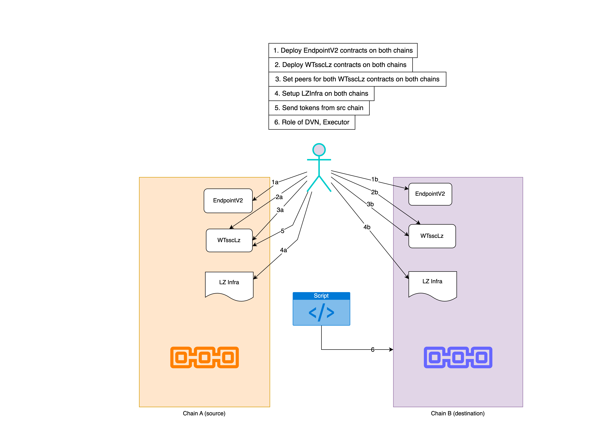

# AutoBridge Trial-1

<u>About</u>: "LZInfra script: a part is LOCAL_EID, another part is REMOTE_EID".

<u>Commit</u>: [4481b04754245f5a33f2e559e3e28c544c645276](https://github.com/subspace/subspace-evm-contracts/commit/4481b04754245f5a33f2e559e3e28c544c645276)

## Description



## 1. Deploy EndpointV2 contracts on both chains

Use `script/EndpointV2.s.sol:EndpointV2Script`

### Nova

```sh
$ forge script ./script/EndpointV2.s.sol:EndpointV2Script --private-key ${DEPLOYER_PRIVATE_KEY} --rpc-url ${NOVA_RPC_URL} --broadcast  --verify --verifier blockscout --verifier-url $NOVA_VERIFIER_URL --legacy

##### 490000
✅  [Success]Hash: 0x103387379b621b159cfe543a75d500b68d4f8b2d5c7936361666741b08754ac8
Contract Address: 0xEAa05fe6582b0230E9Fabcfa9E2AB2f2098E5BB0
Block: 406633
Paid: 0.0024027835 ETH (4805567 gas * 0.5 gwei)
```

```json
"arguments": [
    "490000",
    "0xB751710Af8Ce68677aB960adB103060f38d09714"
],
```

### Sepolia

```sh
$ forge script ./script/EndpointV2.s.sol:EndpointV2Script --private-key ${DEPLOYER_PRIVATE_KEY} --rpc-url ${SEPOLIA_RPC_URL} --broadcast  --verify --verifier blockscout --verifier-url $ETHSEPOLIA_VERIFIER_URL

##### sepolia
✅  [Success]Hash: 0x35bc121c9a55b04ade35acf4dbf774e89ed82899c941cb693a94e4a6e4d658b5
Contract Address: 0x7e1C189a05Cc36AD671D3665c2f6351931841779
Block: 5753504
Paid: 0.004769581167908825 ETH (4805555 gas * 0.992514115 gwei)
```

```json
"arguments": [
    "40161",
    "0xB751710Af8Ce68677aB960adB103060f38d09714"
],
```

## 2. Deploy WTsscLz contracts on both chains

Use `script/WTsscLz.s.sol:WTsscLzScript`.

### Nova

```sh
$ forge script script/WTsscLz.s.sol:WTsscLzScript --rpc-url $NOVA_RPC_URL --private-key $DEPLOYER_PRIVATE_KEY --broadcast --verify --verifier blockscout --verifier-url $NOVA_VERIFIER_URL --legacy

##### 490000
✅  [Success]Hash: 0x1225d4931886380f7fd7a832b863f74db92283f5460e79f72df0c29fd5a4a525
Contract Address: 0x71A8A8fA7fba2e5F74D58dcB567Ce87c46cCEea6
Block: 406768
Paid: 0.001542338 ETH (3084676 gas * 0.5 gwei)
```

```json
"arguments": [
    "\"Wrapped Subspace Token\"",
    "\"WTSSC\"",
    "0xEAa05fe6582b0230E9Fabcfa9E2AB2f2098E5BB0",
    "0xB751710Af8Ce68677aB960adB103060f38d09714"
],
```

### Sepolia

```sh
$ forge script script/WTsscLz.s.sol:WTsscLzScript --rpc-url $SEPOLIA_RPC_URL --private-key $DEPLOYER_PRIVATE_KEY --broadcast --verify --verifier blockscout --verifier-url $ETHSEPOLIA_VERIFIER_URL

##### sepolia
✅  [Success]Hash: 0x09f6babb6dc6e8d5dc85a69e57f45d8bc1dfc1424928bbba174af9ed02a6d84a
Contract Address: 0x1ae29D803707aa8154aa82c4eb4Eff8401a1B94B
Block: 5753608
Paid: 0.0030858612096361 ETH (3084676 gas * 1.000384225 gwei)
```

```json
"arguments": [
    "\"Wrapped Subspace Token\"",
    "\"WTSSC\"",
    "0x7e1C189a05Cc36AD671D3665c2f6351931841779",
    "0xB751710Af8Ce68677aB960adB103060f38d09714"
],
```

## 3. Set peers for both WTsscLz contracts on both chains

💡 This step is only possible when both the contract addresses of `WTsscLz` is known beforehand, so that we can set one using the other & viceversa.

### Nova

Unfortunately, `$ cast send...` step failed ❌ due to some reasons. So, tried with TS script instead.
<!-- FIXME: retry with script as this method failed.-->
<!-- 

```sh
cast send $WTSSCLZ_NOVA "setPeer(uint32,bytes32)" $SEPOLIA_ENDPOINT_V2_ID $(cast --to-bytes32 $WTSSCLZ_SEPOLIA) --private-key $DEPLOYER_PRIVATE_KEY -r $NOVA_RPC_URL --legacy
```

 -->

Arguments:

| Name | Type | Data
| --| -- | -- |
| _eid | uint32 | 40161 |
| _peer | bytes32 | 0x0000000000000000000000001ae29d803707aa8154aa82c4eb4eff8401a1b94b |

### Sepolia

```sh
cast send $WTSSCLZ_SEPOLIA "setPeer(uint32,bytes32)" $NOVA_ENDPOINT_V2_ID $(cast --to-bytes32 $WTSSCLZ_NOVA) --private-key $DEPLOYER_PRIVATE_KEY -r $SEPOLIA_RPC_URL

##### sepolia
✅  [Success]Hash: 0x56675a014ecfba323b42545619eea3edb47ec8038940d1e5363f69d509f5a492
```

Arguments:

| Name | Type | Data
| --| -- | -- |
| _eid | uint32 | 490000 |
| _peer | bytes32 | 0x71a8a8fa7fba2e5f74d58dcb567ce87c46cceea60000000000000000000 |

> Although when running TS script that covers for both the chains at a time, it didn't set peer for Sepolia, although the `_peer` was left padded. So, I think it doesn't really matter if it's left or right padded.

## 4. Setup LZInfra on both chains

Run LZInfra script: `script/LzInfra.s.sol:LzInfraScript` with already deployed EndpointV2 contracts on both chains in [step-1](#1-deploy-endpointv2-contracts-on-both-chains).

### Nova

In order to view the arguments used for each tx on forked RPC, refer this file: [lzinfra-nova-run.json](./lzinfra-nova-run.json) and in order to see all the addresses, refer this file: [lz_infra_addresses_nova.txt](./lz_infra_addresses_nova.txt)

```sh
forge script ./script/LzInfra.s.sol:LzInfraScript --private-key ${DEPLOYER_PRIVATE_KEY} --rpc-url http://127.0.0.1:8545 --broadcast --legacy
```

<details><summary>Log:</summary>

```sh
==========================

Chain 490000

Estimated gas price: 1.4375 gwei

Estimated total gas used for script: 37678713

Estimated amount required: 0.0541631499375 ETH

==========================
##
Sending transactions [0 - 28].
⠒ [00:00:00] [################################################################################################>-------------------------------------------] 20/29 txes (0.0s)##
Waiting for receipts.
⠤ [00:00:00] [##################################################################################################>-------------------------------------] 21/29 receipts (0.0s)
##### 490000
✅  [Success]Hash: 0x80bbb25db405a484c88ee4066537ac1d2f62d6954b4c9d94aa52f399893d94f7
Contract Address: 0xb1334274b86B005244e582e1a11094C711D5D944
Block: 408600
Paid: 0.0009975344375 ETH (693937 gas * 1.4375 gwei)


##### 490000
✅  [Success]Hash: 0x1f580b676563915e086b2c0e76e0629e1e09eb87fbface08d46351f02dce7e13
Contract Address: 0x8434BBFebA81d93469E97ab888089d65e84e1fd5
Block: 408601
Paid: 0.002116974625 ETH (1472678 gas * 1.4375 gwei)


##### 490000
✅  [Success]Hash: 0xfce263e97f386f3cc59bbf0318f26cedb5eeb45b317c7ed31d5c48b98cf8b4d6
Contract Address: 0xC2d6cD33c3a5AE45195c7F600cD81c84a16B9374
Block: 408601
Paid: 0.0059495005625 ETH (4138783 gas * 1.4375 gwei)


##### 490000
✅  [Success]Hash: 0x66c06f7fef8c87c99d83ebb45a2e755d8534772959e440b361da2cebfdb915e1
Contract Address: 0x69B388ea53111B351a541bA3C5e9f6766e8eBB5B
Block: 408601
Paid: 0.0030609535625 ETH (2129359 gas * 1.4375 gwei)


##### 490000
✅  [Success]Hash: 0x097dc4ad644d2f650c82f78e6fafccd3f56a132e6e5e1e533c60bf02c03d88ee
Block: 408601
Paid: 0.0001121293125 ETH (78003 gas * 1.4375 gwei)


##### 490000
✅  [Success]Hash: 0xb7a1228d57c2f8695d24a888a9eee2fcdf776d00c84febb7adb6655998283e85
Block: 408601
Paid: 0.00011215375 ETH (78020 gas * 1.4375 gwei)


##### 490000
✅  [Success]Hash: 0x1183c0bb3dd2faa83cd24e25a66d041fc596ce0cfe864d12ccdcdd03b066ecf5
Block: 408601
Paid: 0.0001122644375 ETH (78097 gas * 1.4375 gwei)


##### 490000
✅  [Success]Hash: 0xb94c57acb5261fc86697b041c688a34cd90e0f92184c6148ba17d2ef724c1776
Contract Address: 0x43eB700E3880BEb2622AD143CF50d2cc22c254e9
Block: 408602
Paid: 0.003648878125 ETH (2538350 gas * 1.4375 gwei)


##### 490000
✅  [Success]Hash: 0xe2d7174aea3fbb284eccbb2cdda27fc9797d7ff332ab7e3a883fea0a0a53db98
Contract Address: 0x7063240061be3ABEde39DC3fd0c4CfFEE4061497
Block: 408602
Paid: 0.000586238375 ETH (407818 gas * 1.4375 gwei)


##### 490000
✅  [Success]Hash: 0x9aaf932ea1e4aa4a05a621939eb747ef2cd439937b8846da5309a7d168d50a1f
Contract Address: 0x56Ec18E6cfdf441a39F8b5c7ec9620EEFd12d010
Block: 408602
Paid: 0.000429295 ETH (298640 gas * 1.4375 gwei)


##### 490000
✅  [Success]Hash: 0xfc788893aa122c11419326e718d93489b808dd75d08e9715d1a0b6da6a70c6a1
Contract Address: 0x04aAc97FC51cC6AbE276D0E32BA4A46224fC3b88
Block: 408602
Paid: 0.0058975866875 ETH (4102669 gas * 1.4375 gwei)


##### 490000
✅  [Success]Hash: 0xa3703e7db789c93ba30b84aef9d46715e126edf2523116fbc7c99ebbec634214
Contract Address: 0x390877EaFbb0C0Ba1c79106FADeF51427E4eDAf9
Block: 408603
Paid: 0.003585651125 ETH (2494366 gas * 1.4375 gwei)


##### 490000
✅  [Success]Hash: 0x5dfd25e977cd1f122c03f04ef2399646cfdb14609defec6177083770dde0bd7c
Contract Address: 0xfC2f95FA02e77efd97F306243271D0861B7f4922
Block: 408603
Paid: 0.0018807401875 ETH (1308341 gas * 1.4375 gwei)


##### 490000
✅  [Success]Hash: 0x55caf05253d51d02ea409d86b5c7b91329a0047066bca1e51fb5e27afa9de3e9
Block: 408603
Paid: 0.000227909875 ETH (158546 gas * 1.4375 gwei)


##### 490000
✅  [Success]Hash: 0x60ae7d50e59e85c0afc3ca9a5220c15cd160982902db78616ae4eff113299cc0
Contract Address: 0xF602F10dc5Dc741Ed1299841B053948951C1a999
Block: 408604
Paid: 0.0046411024375 ETH (3228593 gas * 1.4375 gwei)


##### 490000
✅  [Success]Hash: 0x01eb73d28efbe80b70405d917e284d0f43ab18b580ca6403452582a56afcc0f0
Block: 408605
Paid: 0.000073508 ETH (51136 gas * 1.4375 gwei)


##### 490000
✅  [Success]Hash: 0xcd262f6e955d5a8d5121ec31af9f60b3b7b18e6444fec771bad1354863a594f4
Contract Address: 0x31f9F1Ff259bE6f27d8C3B0ccb30f04dfd647D28
Block: 408605
Paid: 0.0012661385 ETH (880792 gas * 1.4375 gwei)


##### 490000
✅  [Success]Hash: 0xa3b8f332596121c0c1a5882619ccc372e2dc0df6400d91939757ec7f4dbdbec9
Block: 408605
Paid: 0.0000436439375 ETH (30361 gas * 1.4375 gwei)


##### 490000
✅  [Success]Hash: 0xa4b20140766fba491f7a56bd029d552e886b549db6689e7a0a88dcd4d30e1d7e
Block: 408605
Paid: 0.0000433219375 ETH (30137 gas * 1.4375 gwei)


##### 490000
✅  [Success]Hash: 0xe9c086b409bc137a8170568032f180a99ff8fa7d1cfd5d69163d6ab102a0ad6f
Contract Address: 0x7997a1a3A791Ed9D52785DF6c71D9Fa9066b6ea5
Block: 408605
Paid: 0.003980676125 ETH (2769166 gas * 1.4375 gwei)


##### 490000
✅  [Success]Hash: 0x2137000f561c5ef2772c8882165258a87f70b8d66f38aed18d67fe5670bb0c14
Contract Address: 0x7e1C189a05Cc36AD671D3665c2f6351931841779
Block: 408605
Paid: 0.0015614771875 ETH (1086245 gas * 1.4375 gwei)


##### 490000
✅  [Success]Hash: 0xe8ac5258254c6e6eca7095aff72587b69d93dc2dd4433096cfee250e44b5c0f7
Block: 408606
Paid: 0.0004520549375 ETH (314473 gas * 1.4375 gwei)


##### 490000
✅  [Success]Hash: 0x9217bb6f2af6b960e6dc43e2acc215153ecc0d5f052adb1c42707655b6da3970
Block: 408606
Paid: 0.000043599375 ETH (30330 gas * 1.4375 gwei)


##### 490000
✅  [Success]Hash: 0xd24b3b4d78ae6500e1133165b26a411173b82344d0acde263de99eac5ed3cf17
Block: 408607
Paid: 0.00010608175 ETH (73796 gas * 1.4375 gwei)


##### 490000
✅  [Success]Hash: 0x45c15f07da27c703e35497921cedba2718f737584ed87e0cee6abe32252e2a82
Block: 408607
Paid: 0.0000727446875 ETH (50605 gas * 1.4375 gwei)


##### 490000
✅  [Success]Hash: 0x52e0a3b81efd465606dd230b3cc1feba5efb98edd32e5270967123ade778f465
Block: 408607
Paid: 0.0001541675625 ETH (107247 gas * 1.4375 gwei)


##### 490000
✅  [Success]Hash: 0xc971e721dce48e67ab55bbff1064bc67f655478722f80be88f70fc3aac2d89c0
Block: 408607
Paid: 0.00015401375 ETH (107140 gas * 1.4375 gwei)


##### 490000
✅  [Success]Hash: 0xdc642d23a8ec7e6fea3883b7e9c870df5262bbd6a45ec8627f679d9c0ba76e98
Block: 408607
Paid: 0.0000814358125 ETH (56651 gas * 1.4375 gwei)


##### 490000
✅  [Success]Hash: 0x8e8e83f069cdb82b6fc74fc7963e7502fed0e932e940e095e4796d7809ce9d8a
Block: 408608
Paid: 0.0000907393125 ETH (63123 gas * 1.4375 gwei)


==========================
```

</details>

### Sepolia

In order to view the arguments used for each tx on forked RPC, refer this file: [lzinfra-sepolia-run.json](./lzinfra-sepolia-run.json) and in order to see all the addresses, refer this file: [lz_infra_addresses_sepolia.txt](./lz_infra_addresses_sepolia.txt).

```sh
forge script ./script/LzInfra.s.sol:LzInfraScript --private-key ${DEPLOYER_PRIVATE_KEY} --rpc-url ${SEPOLIA_RPC_URL} --broadcast  --verify --verifier blockscout --verifier-url $ETHSEPOLIA_VERIFIER_URL
```

<details><summary>Log:</summary>

```sh
Chain 11155111

Estimated gas price: 1.029893044 gwei

Estimated total gas used for script: 37681910

Estimated amount required: 0.03880833699363404 ETH

==========================
##
Sending transactions [0 - 28].
⠁ [00:00:13] [############################################################################################################################################] 29/29 txes (0.0s)##
Waiting for receipts.
⠁ [00:00:16] [########################################################################################################################################] 29/29 receipts (0.0s)
##### sepolia
✅  [Success]Hash: 0x38925ec702f9d07930bee694e1bda365eaf11bcd0e4779f9002f18f54e56cddb
Contract Address: 0x5647746F01fB974f634D6b42F3e30fFd2376F9C7
Block: 5753773
Paid: 0.00071195015419167 ETH (693937 gas * 1.02595791 gwei)


##### sepolia
✅  [Success]Hash: 0x657369c792f4d77c1ca9e644706679b7651d0e9cbee8f9ad39d8d23584107c4d
Contract Address: 0xAeF5F70F340871d2AF0589b210F7c40AA73963f4
Block: 5753773
Paid: 0.0015109179544779 ETH (1472690 gas * 1.02595791 gwei)


##### sepolia
✅  [Success]Hash: 0xed20022284e5c4aa246e0f9a7320d22371defe1ff4fe19ae93e4abf17281960c
Contract Address: 0x2aA3289C9aaBB049408F2671a48DB006DdE01fA0
Block: 5753773
Paid: 0.00424621715662353 ETH (4138783 gas * 1.02595791 gwei)


##### sepolia
✅  [Success]Hash: 0x1abc0d147647ba02c40f46af230fc1515099b3399f1eb392fd950ddd36afc636
Contract Address: 0xc860046377C5Dfe437501691712Ac7bAdf3A490d
Block: 5753773
Paid: 0.00218463270927969 ETH (2129359 gas * 1.02595791 gwei)


##### sepolia
✅  [Success]Hash: 0xb5b44921958c843ea96d55756d4a548a43a15c321bb7dbe4b56897ff97f7dbc3
Block: 5753773
Paid: 0.00008002779485373 ETH (78003 gas * 1.02595791 gwei)


##### sepolia
✅  [Success]Hash: 0xaed1481c83dd495bd490855ca22822527a9cc1dfa82b4dd32a98f2bbe57f07d6
Block: 5753773
Paid: 0.0000800452361382 ETH (78020 gas * 1.02595791 gwei)


##### sepolia
✅  [Success]Hash: 0x53442c433712decb3f9879943dcccf53ec8f996b264460e6d19b722b5e9923bf
Block: 5753773
Paid: 0.00008012423489727 ETH (78097 gas * 1.02595791 gwei)


##### sepolia
✅  [Success]Hash: 0x73c13951df8bf83be1e259ada5ca5148bbae1231518df0fded5b880498a9fa28
Contract Address: 0x958B1a8329b5Ab13EE0F7780a315FA0Ef717a301
Block: 5753773
Paid: 0.0026042402608485 ETH (2538350 gas * 1.02595791 gwei)


##### sepolia
✅  [Success]Hash: 0xe4001a51a40f4c72074a866900b4be8a002453b153b0fd2761f56e5bf0c01419
Contract Address: 0x8fF90adA0487bC78A5E0E28463964A98ab041720
Block: 5753773
Paid: 0.00041840410294038 ETH (407818 gas * 1.02595791 gwei)


##### sepolia
✅  [Success]Hash: 0x5d03edb65e80dc2ab4d7122183e062c1aaa00e354e89b5f4b32bf2a00c419557
Contract Address: 0x7a97875f91897193Cb370FfCCadc8165655d6Af0
Block: 5753773
Paid: 0.0003063920702424 ETH (298640 gas * 1.02595791 gwei)


##### sepolia
✅  [Success]Hash: 0xb3eb7b4eff6fc9bcfd60939174b56805fa1a30c3ba351f48edf6ac2439356e8d
Contract Address: 0x95635306989f26157505d1A3c5bbB9068FDBEf60
Block: 5753773
Paid: 0.00420916571266179 ETH (4102669 gas * 1.02595791 gwei)


##### sepolia
✅  [Success]Hash: 0x5065ecf0f57d6e914b15309e7933edfbd1ffbf16ade6eeef229c258ae06876d3
Contract Address: 0x1fa46908A3396BECe3d539278D6e3839E67D2B9d
Block: 5753773
Paid: 0.00255910221664014 ETH (2494354 gas * 1.02595791 gwei)


##### sepolia
✅  [Success]Hash: 0x210e2d81ccd422f9b80a5778be6dffb25debeabbaa6f371d12a49af09941008b
Contract Address: 0xFe4430822f79B1Fb24F67593df68947de6A96B28
Block: 5753773
Paid: 0.00134230279792731 ETH (1308341 gas * 1.02595791 gwei)


##### sepolia
✅  [Success]Hash: 0xef55222c452d084f05426efe391ea2f873efa7e1683710fd998b30849da3a50f
Block: 5753773
Paid: 0.00016266152279886 ETH (158546 gas * 1.02595791 gwei)


##### sepolia
✅  [Success]Hash: 0xd2eca1ca55db5694618599cf435ee3273d756d27e8adeac70d4de65dbc722c66
Contract Address: 0x3754b003Bc45E77E89042A17F82b25FDf2C1cd4e
Block: 5753774
Paid: 0.003313893053401229 ETH (3228581 gas * 1.026424009 gwei)


##### sepolia
✅  [Success]Hash: 0xd1e456a631479a06030fb8413f881653af72c2daeb6ee3683cbce860f4919e12
Block: 5753774
Paid: 0.000052499535212332 ETH (51148 gas * 1.026424009 gwei)


##### sepolia
✅  [Success]Hash: 0xa7da43e29d45edd8f1132be2c297c4094c40e27ff14dd75ef1909fa33aceeda6
Contract Address: 0xcd176cE6429897De3bDc9cf2a8461F7985fAe338
Block: 5753774
Paid: 0.000904066055735128 ETH (880792 gas * 1.026424009 gwei)


##### sepolia
✅  [Success]Hash: 0xc90a5a2812d0319750ccb5b796fc24775a71569d21360370d969ff329ef26dd5
Block: 5753774
Paid: 0.000031163259337249 ETH (30361 gas * 1.026424009 gwei)


##### sepolia
✅  [Success]Hash: 0xfdf6b2240fa7c6589619e686f2297febb54340221239940be272641a48f7874b
Block: 5753774
Paid: 0.000030933340359233 ETH (30137 gas * 1.026424009 gwei)


##### sepolia
✅  [Success]Hash: 0xc4593b7b163a4e8d5afddffd8c186f7a393156254849bcc0c9ab2f9379b9c02e
Contract Address: 0xC01d07957A46Bf809BeA5D9158451995D7ca4E5D
Block: 5753774
Paid: 0.002842338467306494 ETH (2769166 gas * 1.026424009 gwei)


##### sepolia
✅  [Success]Hash: 0xd16a209dc68621a5984aba1bd594e85c9e8c76586b968dfc2937992f51db122c
Contract Address: 0xF5ad61B762577a2131b9750f54FDC9878290EAe8
Block: 5753774
Paid: 0.001114947947656205 ETH (1086245 gas * 1.026424009 gwei)


##### sepolia
✅  [Success]Hash: 0xcda0d58c1518c4c18c984f9a7331a8e444cee797a6ff0186fea852abc2141a79
Block: 5753774
Paid: 0.000322782637382257 ETH (314473 gas * 1.026424009 gwei)


##### sepolia
✅  [Success]Hash: 0xe9d92cdecedffc716efc563c81fe7f038f222f6da669308cebfc483c9229c811
Block: 5753774
Paid: 0.00003113144019297 ETH (30330 gas * 1.026424009 gwei)


##### sepolia
✅  [Success]Hash: 0xc3565898723bf810e3e6e9b23f6ac9416f468cb0f70ba65906a1d4489604f662
Block: 5753774
Paid: 0.000075758303256272 ETH (73808 gas * 1.026424009 gwei)


##### sepolia
✅  [Success]Hash: 0xdbe470887eb56b0e2f1222bb5cfc1b43ecb11b63c07d659ba5480c2c699df7ea
Block: 5753774
Paid: 0.000051954504063553 ETH (50617 gas * 1.026424009 gwei)


##### sepolia
✅  [Success]Hash: 0x7c06b4c4110e117de304041fc8a5b256b8ddd33e14ca706498e63138cc3e652a
Block: 5753774
Paid: 0.000110093212781331 ETH (107259 gas * 1.026424009 gwei)


##### sepolia
✅  [Success]Hash: 0x258af4aa642a2d81a768b3f5173588f3dc0348d238c1f8f531cc2c93b08efcfe
Block: 5753774
Paid: 0.000109983385412368 ETH (107152 gas * 1.026424009 gwei)


##### sepolia
✅  [Success]Hash: 0x378b3f9c1a6a1ceddef53b0fd8f92fc1590e5ee6596f31d2f848abb79e05966a
Block: 5753774
Paid: 0.000058160263621967 ETH (56663 gas * 1.026424009 gwei)


##### sepolia
✅  [Success]Hash: 0x018d67f778d04f8aa6c74e763075d5aba0b9bc0171fe2d40f0100c70c5f84eb0
Block: 5753774
Paid: 0.000064803279808215 ETH (63135 gas * 1.026424009 gwei)


==========================

ONCHAIN EXECUTION COMPLETE & SUCCESSFUL.
Total Paid: 0.029610692610048173 ETH (28857474 gas * avg 1.026198995 gwei)
```

</details>

## 5. Send tokens from src chain

Run AutoBridge script: `script/auto_bridge.s.sol:AutoBridgeScript` mainly on src chain to send tokens to dst chain.

> The destination chain is mainly for setting peers.

1. set peers on both sides, if not/incorrectly set. Try to use TS script for this unless you want to debug using Solidity.

```sh
# Network: Nova
# Don't have to do this step on Nova Anvil even when it is reboot as already set on Nova.
❯ bun auto-bridge
$ tsc && node dist/demos/src/auto-bridge/index.js
Incorrect/No peer was set on Nova.
    So, correct peer set on Nova via tx hash: 0x9367f3850cc0ad1a09c96eafbe06f0f5a90a397d222f234377a21c25a61e5646 in block #407717
```

2. `quoteSend`: get quote for sending tokens from src side.
3. `send`: send tokens from src side

Result of TS script is same as expected from Solidity script 🎉.

```sh
# Network: Nova Anvil
❯ bun auto-bridge
$ tsc && node dist/demos/src/auto-bridge/index.js
Deposited 10000000000000000 via tx hash: 0x767849acc7ceb6547a479b028e42549143856acfedea49532f0d9bb1d5299ab5 in block #408611
token[0]'s total supply: 0.01 WTSSC
Tx hash for sending tokens from contract '0x71A8...Eea6': 
    '0xaaa9be41ea6a3c48d19fc90b85bbeddd3611d7940e8583c0e43c11c2bf65ec72' in block #408612
token[1]'s total supply: 0.0 WTSSC
```

<details><summary>Log:</summary>

```sh
$ forge script ./script/auto_bridge.s.sol:AutoBridgeScript --private-key ${DEPLOYER_PRIVATE_KEY} --rpc-url http://127.0.0.1:8545 --broadcast --legacy -vvvv
[⠒] Compiling...
[⠔] Compiling 1 files with 0.8.24
[⠒] Solc 0.8.24 finished in 1.38s
Compiler run successful!
Traces:
  [247376] AutoBridgeScript::run()
    ├─ [0] VM::startBroadcast(0xB751710Af8Ce68677aB960adB103060f38d09714)
    │   └─ ← [Return] 
    ├─ [2619] 0x71A8A8fA7fba2e5F74D58dcB567Ce87c46cCEea6::isPeer(40161 [4.016e4], 0x0000000000000000000000001ae29d803707aa8154aa82c4eb4eff8401a1b94b) [staticcall]
    │   └─ ← [Return] true
    ├─ [2664] 0x71A8A8fA7fba2e5F74D58dcB567Ce87c46cCEea6::balanceOf(0xB751710Af8Ce68677aB960adB103060f38d09714) [staticcall]
    │   └─ ← [Return] 0
    ├─ [0] console::log("===Before deposit:") [staticcall]
    │   └─ ← [Stop] 
    ├─ [0] console::log("\tWTSSC Balance: ", 0) [staticcall]
    │   └─ ← [Stop] 
    ├─ [45874] 0x71A8A8fA7fba2e5F74D58dcB567Ce87c46cCEea6::deposit{value: 10000000000000000}()
    │   ├─ emit Transfer(from: 0x0000000000000000000000000000000000000000, to: 0xB751710Af8Ce68677aB960adB103060f38d09714, value: 10000000000000000 [1e16])
    │   ├─ emit Deposit(from: 0xB751710Af8Ce68677aB960adB103060f38d09714, amount: 10000000000000000 [1e16])
    │   └─ ← [Stop] 
    ├─ [0] console::log("===After deposit:") [staticcall]
    │   └─ ← [Stop] 
    ├─ [664] 0x71A8A8fA7fba2e5F74D58dcB567Ce87c46cCEea6::balanceOf(0xB751710Af8Ce68677aB960adB103060f38d09714) [staticcall]
    │   └─ ← [Return] 10000000000000000 [1e16]
    ├─ [0] console::log("\tWTSSC Balance: ", 10000000000000000 [1e16]) [staticcall]
    │   └─ ← [Stop] 
    ├─ [109469] 0x71A8A8fA7fba2e5F74D58dcB567Ce87c46cCEea6::quoteSend(SendParam({ dstEid: 40161 [4.016e4], to: 0x000000000000000000000000b751710af8ce68677ab960adb103060f38d09714, amountLD: 10000000000000000 [1e16], minAmountLD: 10000000000000000 [1e16], extraOptions: 0x00030100110100000000000000000000000000030d40, composeMsg: 0x, oftCmd: 0x }), false) [staticcall]
    │   ├─ [97414] 0xEAa05fe6582b0230E9Fabcfa9E2AB2f2098E5BB0::quote(MessagingParams({ dstEid: 40161 [4.016e4], receiver: 0x0000000000000000000000001ae29d803707aa8154aa82c4eb4eff8401a1b94b, message: 0x000000000000000000000000b751710af8ce68677ab960adb103060f38d097140000000000002710, options: 0x00030100110100000000000000000000000000030d40, payInLzToken: false }), 0x71A8A8fA7fba2e5F74D58dcB567Ce87c46cCEea6) [staticcall]
    │   │   ├─ [83640] 0xC2d6cD33c3a5AE45195c7F600cD81c84a16B9374::quote(Packet({ nonce: 1, srcEid: 490000 [4.9e5], sender: 0x71A8A8fA7fba2e5F74D58dcB567Ce87c46cCEea6, dstEid: 40161 [4.016e4], receiver: 0x0000000000000000000000001ae29d803707aa8154aa82c4eb4eff8401a1b94b, guid: 0xecdd7a8e31835c0d31c10cce0425339a7cf315b2246f82a5b4c1ecc1312f189e, message: 0x000000000000000000000000b751710af8ce68677ab960adb103060f38d097140000000000002710 }), 0x00030100110100000000000000000000000000030d40, false) [staticcall]
    │   │   │   ├─ [30174] 0xF602F10dc5Dc741Ed1299841B053948951C1a999::getFee(40161 [4.016e4], 1, 0x71A8A8fA7fba2e5F74D58dcB567Ce87c46cCEea6, 0x) [staticcall]
    │   │   │   │   ├─ [14533] 0x31f9F1Ff259bE6f27d8C3B0ccb30f04dfd647D28::getFee(FeeParams({ priceFeed: 0xfC2f95FA02e77efd97F306243271D0861B7f4922, dstEid: 40161 [4.016e4], confirmations: 1, sender: 0x71A8A8fA7fba2e5F74D58dcB567Ce87c46cCEea6, quorum: 1, defaultMultiplierBps: 100 }), DstConfig({ gas: 5000, multiplierBps: 0, floorMarginUSD: 0 }), 0x) [staticcall]
    │   │   │   │   │   ├─ [8488] 0xfC2f95FA02e77efd97F306243271D0861B7f4922::estimateFeeByEid(40161 [4.016e4], 452, 5000) [staticcall]
    │   │   │   │   │   │   └─ ← [Return] 0, 0, 100000000000000000000 [1e20], 0
    │   │   │   │   │   └─ ← [Return] 0
    │   │   │   │   └─ ← [Return] 0
    │   │   │   ├─ [25228] 0x7997a1a3A791Ed9D52785DF6c71D9Fa9066b6ea5::getFee(40161 [4.016e4], 0x71A8A8fA7fba2e5F74D58dcB567Ce87c46cCEea6, 40, 0x0100110100000000000000000000000000030d40) [staticcall]
    │   │   │   │   ├─ [7582] 0x7e1C189a05Cc36AD671D3665c2f6351931841779::getFee(FeeParams({ priceFeed: 0xfC2f95FA02e77efd97F306243271D0861B7f4922, dstEid: 40161 [4.016e4], sender: 0x71A8A8fA7fba2e5F74D58dcB567Ce87c46cCEea6, calldataSize: 40, defaultMultiplierBps: 12000 [1.2e4] }), DstConfig({ baseGas: 5000, multiplierBps: 10000 [1e4], floorMarginUSD: 10000000000 [1e10], nativeCap: 1000000000 [1e9] }), 0x0100110100000000000000000000000000030d40) [staticcall]
    │   │   │   │   │   ├─ [2488] 0xfC2f95FA02e77efd97F306243271D0861B7f4922::estimateFeeByEid(40161 [4.016e4], 40, 205000 [2.05e5]) [staticcall]
    │   │   │   │   │   │   └─ ← [Return] 0, 0, 100000000000000000000 [1e20], 0
    │   │   │   │   │   └─ ← [Return] 0
    │   │   │   │   └─ ← [Return] 0
    │   │   │   └─ ← [Return] MessagingFee({ nativeFee: 0, lzTokenFee: 0 })
    │   │   └─ ← [Return] MessagingFee({ nativeFee: 0, lzTokenFee: 0 })
    │   └─ ← [Return] MessagingFee({ nativeFee: 0, lzTokenFee: 0 })
    ├─ [0] console::log("===Quote fee: ", 0) [staticcall]
    │   └─ ← [Stop] 
    ├─ [95558] 0x71A8A8fA7fba2e5F74D58dcB567Ce87c46cCEea6::send(SendParam({ dstEid: 40161 [4.016e4], to: 0x000000000000000000000000b751710af8ce68677ab960adb103060f38d09714, amountLD: 10000000000000000 [1e16], minAmountLD: 10000000000000000 [1e16], extraOptions: 0x00030100110100000000000000000000000000030d40, composeMsg: 0x, oftCmd: 0x }), MessagingFee({ nativeFee: 0, lzTokenFee: 0 }), 0xB751710Af8Ce68677aB960adB103060f38d09714)
    │   ├─ emit Transfer(from: 0xB751710Af8Ce68677aB960adB103060f38d09714, to: 0x0000000000000000000000000000000000000000, value: 10000000000000000 [1e16])
    │   ├─ [83714] 0xEAa05fe6582b0230E9Fabcfa9E2AB2f2098E5BB0::send(MessagingParams({ dstEid: 40161 [4.016e4], receiver: 0x0000000000000000000000001ae29d803707aa8154aa82c4eb4eff8401a1b94b, message: 0x000000000000000000000000b751710af8ce68677ab960adb103060f38d097140000000000002710, options: 0x00030100110100000000000000000000000000030d40, payInLzToken: false }), 0xB751710Af8Ce68677aB960adB103060f38d09714)
    │   │   ├─ [44397] 0xC2d6cD33c3a5AE45195c7F600cD81c84a16B9374::send(Packet({ nonce: 1, srcEid: 490000 [4.9e5], sender: 0x71A8A8fA7fba2e5F74D58dcB567Ce87c46cCEea6, dstEid: 40161 [4.016e4], receiver: 0x0000000000000000000000001ae29d803707aa8154aa82c4eb4eff8401a1b94b, guid: 0xecdd7a8e31835c0d31c10cce0425339a7cf315b2246f82a5b4c1ecc1312f189e, message: 0x000000000000000000000000b751710af8ce68677ab960adb103060f38d097140000000000002710 }), 0x00030100110100000000000000000000000000030d40, false)
    │   │   │   ├─ [12919] 0x7997a1a3A791Ed9D52785DF6c71D9Fa9066b6ea5::assignJob(40161 [4.016e4], 0x71A8A8fA7fba2e5F74D58dcB567Ce87c46cCEea6, 40, 0x0100110100000000000000000000000000030d40)
    │   │   │   │   ├─ [7622] 0x7e1C189a05Cc36AD671D3665c2f6351931841779::getFeeOnSend(FeeParams({ priceFeed: 0xfC2f95FA02e77efd97F306243271D0861B7f4922, dstEid: 40161 [4.016e4], sender: 0x71A8A8fA7fba2e5F74D58dcB567Ce87c46cCEea6, calldataSize: 40, defaultMultiplierBps: 12000 [1.2e4] }), DstConfig({ baseGas: 5000, multiplierBps: 10000 [1e4], floorMarginUSD: 10000000000 [1e10], nativeCap: 1000000000 [1e9] }), 0x0100110100000000000000000000000000030d40)
    │   │   │   │   │   ├─ [2437] 0xfC2f95FA02e77efd97F306243271D0861B7f4922::estimateFeeOnSend(40161 [4.016e4], 40, 205000 [2.05e5])
    │   │   │   │   │   │   └─ ← [Return] 0, 0, 100000000000000000000 [1e20], 0
    │   │   │   │   │   └─ ← [Return] 0
    │   │   │   │   └─ ← [Return] 0
    │   │   │   ├─ emit ExecutorFeePaid(executor: 0x7997a1a3A791Ed9D52785DF6c71D9Fa9066b6ea5, fee: 0)
    │   │   │   ├─ [12291] 0xF602F10dc5Dc741Ed1299841B053948951C1a999::assignJob(AssignJobParam({ dstEid: 40161 [4.016e4], packetHeader: 0x01000000000000000100077a1000000000000000000000000071a8a8fa7fba2e5f74d58dcb567ce87c46cceea600009ce10000000000000000000000001ae29d803707aa8154aa82c4eb4eff8401a1b94b, payloadHash: 0xd1a10d9ab15d1b22216d38d80125d4f8b183f108c40d46c1e24f253db221f53c, confirmations: 1, sender: 0x71A8A8fA7fba2e5F74D58dcB567Ce87c46cCEea6 }), 0x)
    │   │   │   │   ├─ [6005] 0x31f9F1Ff259bE6f27d8C3B0ccb30f04dfd647D28::getFeeOnSend(FeeParams({ priceFeed: 0xfC2f95FA02e77efd97F306243271D0861B7f4922, dstEid: 40161 [4.016e4], confirmations: 1, sender: 0x71A8A8fA7fba2e5F74D58dcB567Ce87c46cCEea6, quorum: 1, defaultMultiplierBps: 100 }), DstConfig({ gas: 5000, multiplierBps: 0, floorMarginUSD: 0 }), 0x)
    │   │   │   │   │   ├─ [2437] 0xfC2f95FA02e77efd97F306243271D0861B7f4922::estimateFeeOnSend(40161 [4.016e4], 452, 5000)
    │   │   │   │   │   │   └─ ← [Return] 0, 0, 100000000000000000000 [1e20], 0
    │   │   │   │   │   └─ ← [Return] 0
    │   │   │   │   └─ ← [Return] 0
    │   │   │   ├─ emit DVNFeePaid(requiredDVNs: [0xF602F10dc5Dc741Ed1299841B053948951C1a999], optionalDVNs: [], fees: [0])
    │   │   │   └─ ← [Return] MessagingFee({ nativeFee: 0, lzTokenFee: 0 }), 0x01000000000000000100077a1000000000000000000000000071a8a8fa7fba2e5f74d58dcb567ce87c46cceea600009ce10000000000000000000000001ae29d803707aa8154aa82c4eb4eff8401a1b94becdd7a8e31835c0d31c10cce0425339a7cf315b2246f82a5b4c1ecc1312f189e000000000000000000000000b751710af8ce68677ab960adb103060f38d097140000000000002710
    │   │   ├─ emit PacketSent(encodedPayload: 0x01000000000000000100077a1000000000000000000000000071a8a8fa7fba2e5f74d58dcb567ce87c46cceea600009ce10000000000000000000000001ae29d803707aa8154aa82c4eb4eff8401a1b94becdd7a8e31835c0d31c10cce0425339a7cf315b2246f82a5b4c1ecc1312f189e000000000000000000000000b751710af8ce68677ab960adb103060f38d097140000000000002710, options: 0x00030100110100000000000000000000000000030d40, sendLibrary: 0xC2d6cD33c3a5AE45195c7F600cD81c84a16B9374)
    │   │   └─ ← [Return] MessagingReceipt({ guid: 0xecdd7a8e31835c0d31c10cce0425339a7cf315b2246f82a5b4c1ecc1312f189e, nonce: 1, fee: MessagingFee({ nativeFee: 0, lzTokenFee: 0 }) })
    │   ├─ emit OFTSent(guid: 0xecdd7a8e31835c0d31c10cce0425339a7cf315b2246f82a5b4c1ecc1312f189e, dstEid: 40161 [4.016e4], fromAddress: 0xB751710Af8Ce68677aB960adB103060f38d09714, amountSentLD: 10000000000000000 [1e16], amountReceivedLD: 10000000000000000 [1e16])
    │   └─ ← [Return] MessagingReceipt({ guid: 0xecdd7a8e31835c0d31c10cce0425339a7cf315b2246f82a5b4c1ecc1312f189e, nonce: 1, fee: MessagingFee({ nativeFee: 0, lzTokenFee: 0 }) }), OFTReceipt({ amountSentLD: 10000000000000000 [1e16], amountReceivedLD: 10000000000000000 [1e16] })
    ├─ [0] VM::stopBroadcast()
    │   └─ ← [Return] 
    └─ ← [Stop] 


Script ran successfully.

== Logs ==
  ===Before deposit:
    WTSSC Balance:  0
  ===After deposit:
    WTSSC Balance:  10000000000000000
  ===Quote fee:  0

## Setting up 1 EVM.
==========================
Simulated On-chain Traces:

  [47874] 0x71A8A8fA7fba2e5F74D58dcB567Ce87c46cCEea6::deposit{value: 10000000000000000}()
    ├─ emit Transfer(from: 0x0000000000000000000000000000000000000000, to: 0xB751710Af8Ce68677aB960adB103060f38d09714, value: 10000000000000000 [1e16])
    ├─ emit Deposit(from: 0xB751710Af8Ce68677aB960adB103060f38d09714, amount: 10000000000000000 [1e16])
    └─ ← [Stop] 

  [162258] 0x71A8A8fA7fba2e5F74D58dcB567Ce87c46cCEea6::send(SendParam({ dstEid: 40161 [4.016e4], to: 0x000000000000000000000000b751710af8ce68677ab960adb103060f38d09714, amountLD: 10000000000000000 [1e16], minAmountLD: 10000000000000000 [1e16], extraOptions: 0x00030100110100000000000000000000000000030d40, composeMsg: 0x, oftCmd: 0x }), MessagingFee({ nativeFee: 0, lzTokenFee: 0 }), 0xB751710Af8Ce68677aB960adB103060f38d09714)
    ├─ emit Transfer(from: 0xB751710Af8Ce68677aB960adB103060f38d09714, to: 0x0000000000000000000000000000000000000000, value: 10000000000000000 [1e16])
    ├─ [144714] 0xEAa05fe6582b0230E9Fabcfa9E2AB2f2098E5BB0::send(MessagingParams({ dstEid: 40161 [4.016e4], receiver: 0x0000000000000000000000001ae29d803707aa8154aa82c4eb4eff8401a1b94b, message: 0x000000000000000000000000b751710af8ce68677ab960adb103060f38d097140000000000002710, options: 0x00030100110100000000000000000000000000030d40, payInLzToken: false }), 0xB751710Af8Ce68677aB960adB103060f38d09714)
    │   ├─ [96897] 0xC2d6cD33c3a5AE45195c7F600cD81c84a16B9374::send(Packet({ nonce: 1, srcEid: 490000 [4.9e5], sender: 0x71A8A8fA7fba2e5F74D58dcB567Ce87c46cCEea6, dstEid: 40161 [4.016e4], receiver: 0x0000000000000000000000001ae29d803707aa8154aa82c4eb4eff8401a1b94b, guid: 0xecdd7a8e31835c0d31c10cce0425339a7cf315b2246f82a5b4c1ecc1312f189e, message: 0x000000000000000000000000b751710af8ce68677ab960adb103060f38d097140000000000002710 }), 0x00030100110100000000000000000000000000030d40, false)
    │   │   ├─ [33919] 0x7997a1a3A791Ed9D52785DF6c71D9Fa9066b6ea5::assignJob(40161 [4.016e4], 0x71A8A8fA7fba2e5F74D58dcB567Ce87c46cCEea6, 40, 0x0100110100000000000000000000000000030d40)
    │   │   │   ├─ [16122] 0x7e1C189a05Cc36AD671D3665c2f6351931841779::getFeeOnSend(FeeParams({ priceFeed: 0xfC2f95FA02e77efd97F306243271D0861B7f4922, dstEid: 40161 [4.016e4], sender: 0x71A8A8fA7fba2e5F74D58dcB567Ce87c46cCEea6, calldataSize: 40, defaultMultiplierBps: 12000 [1.2e4] }), DstConfig({ baseGas: 5000, multiplierBps: 10000 [1e4], floorMarginUSD: 10000000000 [1e10], nativeCap: 1000000000 [1e9] }), 0x0100110100000000000000000000000000030d40)
    │   │   │   │   ├─ [8437] 0xfC2f95FA02e77efd97F306243271D0861B7f4922::estimateFeeOnSend(40161 [4.016e4], 40, 205000 [2.05e5])
    │   │   │   │   │   └─ ← [Return] 0, 0, 100000000000000000000 [1e20], 0
    │   │   │   │   └─ ← [Return] 0
    │   │   │   └─ ← [Return] 0
    │   │   ├─ emit ExecutorFeePaid(executor: 0x7997a1a3A791Ed9D52785DF6c71D9Fa9066b6ea5, fee: 0)
    │   │   ├─ [24791] 0xF602F10dc5Dc741Ed1299841B053948951C1a999::assignJob(AssignJobParam({ dstEid: 40161 [4.016e4], packetHeader: 0x01000000000000000100077a1000000000000000000000000071a8a8fa7fba2e5f74d58dcb567ce87c46cceea600009ce10000000000000000000000001ae29d803707aa8154aa82c4eb4eff8401a1b94b, payloadHash: 0xd1a10d9ab15d1b22216d38d80125d4f8b183f108c40d46c1e24f253db221f53c, confirmations: 1, sender: 0x71A8A8fA7fba2e5F74D58dcB567Ce87c46cCEea6 }), 0x)
    │   │   │   ├─ [6005] 0x31f9F1Ff259bE6f27d8C3B0ccb30f04dfd647D28::getFeeOnSend(FeeParams({ priceFeed: 0xfC2f95FA02e77efd97F306243271D0861B7f4922, dstEid: 40161 [4.016e4], confirmations: 1, sender: 0x71A8A8fA7fba2e5F74D58dcB567Ce87c46cCEea6, quorum: 1, defaultMultiplierBps: 100 }), DstConfig({ gas: 5000, multiplierBps: 0, floorMarginUSD: 0 }), 0x)
    │   │   │   │   ├─ [2437] 0xfC2f95FA02e77efd97F306243271D0861B7f4922::estimateFeeOnSend(40161 [4.016e4], 452, 5000)
    │   │   │   │   │   └─ ← [Return] 0, 0, 100000000000000000000 [1e20], 0
    │   │   │   │   └─ ← [Return] 0
    │   │   │   └─ ← [Return] 0
    │   │   ├─ emit DVNFeePaid(requiredDVNs: [0xF602F10dc5Dc741Ed1299841B053948951C1a999], optionalDVNs: [], fees: [0])
    │   │   └─ ← [Return] MessagingFee({ nativeFee: 0, lzTokenFee: 0 }), 0x01000000000000000100077a1000000000000000000000000071a8a8fa7fba2e5f74d58dcb567ce87c46cceea600009ce10000000000000000000000001ae29d803707aa8154aa82c4eb4eff8401a1b94becdd7a8e31835c0d31c10cce0425339a7cf315b2246f82a5b4c1ecc1312f189e000000000000000000000000b751710af8ce68677ab960adb103060f38d097140000000000002710
    │   ├─ emit PacketSent(encodedPayload: 0x01000000000000000100077a1000000000000000000000000071a8a8fa7fba2e5f74d58dcb567ce87c46cceea600009ce10000000000000000000000001ae29d803707aa8154aa82c4eb4eff8401a1b94becdd7a8e31835c0d31c10cce0425339a7cf315b2246f82a5b4c1ecc1312f189e000000000000000000000000b751710af8ce68677ab960adb103060f38d097140000000000002710, options: 0x00030100110100000000000000000000000000030d40, sendLibrary: 0xC2d6cD33c3a5AE45195c7F600cD81c84a16B9374)
    │   └─ ← [Return] MessagingReceipt({ guid: 0xecdd7a8e31835c0d31c10cce0425339a7cf315b2246f82a5b4c1ecc1312f189e, nonce: 1, fee: MessagingFee({ nativeFee: 0, lzTokenFee: 0 }) })
    ├─ emit OFTSent(guid: 0xecdd7a8e31835c0d31c10cce0425339a7cf315b2246f82a5b4c1ecc1312f189e, dstEid: 40161 [4.016e4], fromAddress: 0xB751710Af8Ce68677aB960adB103060f38d09714, amountSentLD: 10000000000000000 [1e16], amountReceivedLD: 10000000000000000 [1e16])
    └─ ← [Return] MessagingReceipt({ guid: 0xecdd7a8e31835c0d31c10cce0425339a7cf315b2246f82a5b4c1ecc1312f189e, nonce: 1, fee: MessagingFee({ nativeFee: 0, lzTokenFee: 0 }) }), OFTReceipt({ amountSentLD: 10000000000000000 [1e16], amountReceivedLD: 10000000000000000 [1e16] })


==========================

Chain 490000

Estimated gas price: 1.131537793 gwei

Estimated total gas used for script: 372895

Estimated amount required: 0.000421944785320735 ETH

==========================
##
Sending transactions [0 - 1].
⠉ [00:00:00] [##############################################################################################################################################] 2/2 txes (0.0s)##
Waiting for receipts.
⠙ [00:00:00] [##########################################################################################################################################] 2/2 receipts (0.0s)
##### 490000
✅  [Success]Hash: 0xe45374899cf5d3073268b1ede845160a3be06e6fdf6fb1ccf76faec8d4ae84c6
Block: 408609
Paid: 0.000078005952373834 ETH (68938 gas * 1.131537793 gwei)


##### 490000
✅  [Success]Hash: 0x4f4723a8ff351dab741a842fefd040f42d8ed238974f87ba6e4e886e2c08d8b0
Block: 408610
Paid: 0.000210504501782962 ETH (186034 gas * 1.131537793 gwei)


==========================

ONCHAIN EXECUTION COMPLETE & SUCCESSFUL.
Total Paid: 0.000288510454156796 ETH (254972 gas * avg 1.131537793 gwei)
```

</details>

Native fee & LZToken fee both are zero.

- [ ] TODO: Need to diagnose that later via setting suitable values in `PriceFeed`.

## 6. Role of DVN, Executor

Listen to emitted events from src chain and extract message for verification & relaying message over to dst chain.

> Scripts available in both Solidity & TS. Use solidity only if you want to debug

### Using TS script

<details><summary>Log:</summary>

```sh
bun auto-bridge:dvn
$ tsc && node dist/demos/src/auto-bridge/dvn.js
Listening for emitted events from 0x71A8...Eea6 on Nova...
Transfer! Source
OFT Sent!
====Packet Sent!
Encoded Packet Hex: 0x01000000000000000300077a1000000000000000000000000071a8a8fa7fba2e5f74d58dcb567ce87c46cceea600009ce10000000000000000000000001ae29d803707aa8154aa82c4eb4eff8401a1b94b34637c4c515a0ecae595266c4ca5abe84416d4aee6912a7eebefa8ee1478f31f000000000000000000000000b751710af8ce68677ab960adb103060f38d097140000000000002710}
Executor Fee Paid!
DVN Fee Paid!
Receiver MessageLib Address: 0xc860046377C5Dfe437501691712Ac7bAdf3A490d
Uln config: {"confirmations":"1","requiredDVNCount":"1","optionalDVNCount":"0","optionalDVNThreshold":"0","requiredDVNs":["0x3754b003Bc45E77E89042A17F82b25FDf2C1cd4e"],"optionalDVNs":[]}
Header: 0x01000000000000000300077a1000000000000000000000000071a8a8fa7fba2e5f74d58dcb567ce87c46cceea600009ce10000000000000000000000001ae29d803707aa8154aa82c4eb4eff8401a1b94b
Payload Hash: 0x017df2faa1952fbee13c291439fdc1a73d4bf47512c8ee50d5684c35e006acae
Verify | tx hash: 0x0831781eeed0e52098f5a3dcdaa3307bd9dc37fb43b1351ac009bf2d15516dba in block #5754951
/Users/abhi3700/F/coding/github_repos/subspace/layerzero-demo/demos/node_modules/@ethersproject/logger/lib/index.js:238
        var error = new Error(message);
                    ^

Error: transaction failed [ See: https://links.ethers.org/v5-errors-CALL_EXCEPTION ] (transactionHash="0xc2e42a978d08bcb7a73b7211605ea458dea6622b9fe9f7160dcce670229431db", transaction={"type":2,"chainId":11155111,"nonce":144,"maxPriorityFeePerGas":{"type":"BigNumber","hex":"0x59682f00"},"maxFeePerGas":{"type":"BigNumber","hex":"0x59683b40"},"gasPrice":null,"gasLimit":{"type":"BigNumber","hex":"0x030d40"},"to":"0xc860046377C5Dfe437501691712Ac7bAdf3A490d","value":{"type":"BigNumber","hex":"0x00"},"data":"0x0894edf10000000000000000000000000000000000000000000000000000000000000040017df2faa1952fbee13c291439fdc1a73d4bf47512c8ee50d5684c35e006acae000000000000000000000000000000000000000000000000000000000000005101000000000000000300077a1000000000000000000000000071a8a8fa7fba2e5f74d58dcb567ce87c46cceea600009ce10000000000000000000000001ae29d803707aa8154aa82c4eb4eff8401a1b94b000000000000000000000000000000","accessList":[],"hash":"0xc2e42a978d08bcb7a73b7211605ea458dea6622b9fe9f7160dcce670229431db","v":0,"r":"0x27d52ae06246a8983080f42ba637931f0af489afe78e9db8019d45ce47b058ca","s":"0x0523a29817ef20a80dbb3629d90df77dcaf3538da8e52d1a649ac997b1e342b0","from":"0xB751710Af8Ce68677aB960adB103060f38d09714","confirmations":0}, receipt={"to":"0xc860046377C5Dfe437501691712Ac7bAdf3A490d","from":"0xB751710Af8Ce68677aB960adB103060f38d09714","contractAddress":null,"transactionIndex":7,"gasUsed":{"type":"BigNumber","hex":"0xa604"},"logsBloom":"0x00000000000000000000000000000000000000000000000000000000000000000000000000000000000000000000000000000000000000000000000000000000000000000000000000000000000000000000000000000000000000000000000000000000000000000000000000000000000000000000000000000000000000000000000000000000000000000000000000000000000000000000000000000000000000000000000000000000000000000000000000000000000000000000000000000000000000000000000000000000000000000000000000000000000000000000000000000000000000000000000000000000000000000000000000000000","blockHash":"0x429ca5ed5325855bd02a7e2a57da6b15fbe031651abdf092f5fe71a6fe17090e","transactionHash":"0xc2e42a978d08bcb7a73b7211605ea458dea6622b9fe9f7160dcce670229431db","logs":[],"blockNumber":5754953,"confirmations":1,"cumulativeGasUsed":{"type":"BigNumber","hex":"0x4850bb"},"effectiveGasPrice":{"type":"BigNumber","hex":"0x5968347c"},"status":0,"type":2,"byzantium":true}, code=CALL_EXCEPTION, version=providers/5.7.2)
    at Logger.makeError (/Users/abhi3700/F/coding/github_repos/subspace/layerzero-demo/demos/node_modules/@ethersproject/logger/lib/index.js:238:21)
    at Logger.throwError (/Users/abhi3700/F/coding/github_repos/subspace/layerzero-demo/demos/node_modules/@ethersproject/logger/lib/index.js:247:20)
    at JsonRpcProvider.<anonymous> (/Users/abhi3700/F/coding/github_repos/subspace/layerzero-demo/demos/node_modules/@ethersproject/providers/lib/base-provider.js:1693:36)
    at step (/Users/abhi3700/F/coding/github_repos/subspace/layerzero-demo/demos/node_modules/@ethersproject/providers/lib/base-provider.js:48:23)
    at Object.next (/Users/abhi3700/F/coding/github_repos/subspace/layerzero-demo/demos/node_modules/@ethersproject/providers/lib/base-provider.js:29:53)
    at fulfilled (/Users/abhi3700/F/coding/github_repos/subspace/layerzero-demo/demos/node_modules/@ethersproject/providers/lib/base-provider.js:20:58) {
  reason: 'transaction failed',
  code: 'CALL_EXCEPTION',
  transactionHash: '0xc2e42a978d08bcb7a73b7211605ea458dea6622b9fe9f7160dcce670229431db',
  transaction: {
    type: 2,
    chainId: 11155111,
    nonce: 144,
    maxPriorityFeePerGas: BigNumber { _hex: '0x59682f00', _isBigNumber: true },
    maxFeePerGas: BigNumber { _hex: '0x59683b40', _isBigNumber: true },
    gasPrice: null,
    gasLimit: BigNumber { _hex: '0x030d40', _isBigNumber: true },
    to: '0xc860046377C5Dfe437501691712Ac7bAdf3A490d',
    value: BigNumber { _hex: '0x00', _isBigNumber: true },
    data: '0x0894edf10000000000000000000000000000000000000000000000000000000000000040017df2faa1952fbee13c291439fdc1a73d4bf47512c8ee50d5684c35e006acae000000000000000000000000000000000000000000000000000000000000005101000000000000000300077a1000000000000000000000000071a8a8fa7fba2e5f74d58dcb567ce87c46cceea600009ce10000000000000000000000001ae29d803707aa8154aa82c4eb4eff8401a1b94b000000000000000000000000000000',
    accessList: [],
    hash: '0xc2e42a978d08bcb7a73b7211605ea458dea6622b9fe9f7160dcce670229431db',
    v: 0,
    r: '0x27d52ae06246a8983080f42ba637931f0af489afe78e9db8019d45ce47b058ca',
    s: '0x0523a29817ef20a80dbb3629d90df77dcaf3538da8e52d1a649ac997b1e342b0',
    from: '0xB751710Af8Ce68677aB960adB103060f38d09714',
    confirmations: 0,
    wait: [Function (anonymous)]
  },
  receipt: {
    to: '0xc860046377C5Dfe437501691712Ac7bAdf3A490d',
    from: '0xB751710Af8Ce68677aB960adB103060f38d09714',
    contractAddress: null,
    transactionIndex: 7,
    gasUsed: BigNumber { _hex: '0xa604', _isBigNumber: true },
    logsBloom: '0x00000000000000000000000000000000000000000000000000000000000000000000000000000000000000000000000000000000000000000000000000000000000000000000000000000000000000000000000000000000000000000000000000000000000000000000000000000000000000000000000000000000000000000000000000000000000000000000000000000000000000000000000000000000000000000000000000000000000000000000000000000000000000000000000000000000000000000000000000000000000000000000000000000000000000000000000000000000000000000000000000000000000000000000000000000000',
    blockHash: '0x429ca5ed5325855bd02a7e2a57da6b15fbe031651abdf092f5fe71a6fe17090e',
    transactionHash: '0xc2e42a978d08bcb7a73b7211605ea458dea6622b9fe9f7160dcce670229431db',
    logs: [],
    blockNumber: 5754953,
    confirmations: 1,
    cumulativeGasUsed: BigNumber { _hex: '0x4850bb', _isBigNumber: true },
    effectiveGasPrice: BigNumber { _hex: '0x5968347c', _isBigNumber: true },
    status: 0,
    type: 2,
    byzantium: true
  }
}

Node.js v18.18.0
error: script "auto-bridge:dvn" exited with code 1
```

</details>

So, far, the encodedPacket from emitted event `PacketSent` event is:

```sh
Encoded Packet Hex: 0x01000000000000000300077a1000000000000000000000000071a8a8fa7fba2e5f74d58dcb567ce87c46cceea600009ce10000000000000000000000001ae29d803707aa8154aa82c4eb4eff8401a1b94b34637c4c515a0ecae595266c4ca5abe84416d4aee6912a7eebefa8ee1478f31f000000000000000000000000b751710af8ce68677ab960adb103060f38d097140000000000002710}
```

And `ReceiveUln302.verify()` function passes ✅, whereas `ReceiveUln302.commitVerification()` fails ❌.

### Using Solidity script

In order to debug further as to why the commit verification fails, used AutoBridgeDVN script: `script/autobridge_dvn.s.sol:AutoBridgeDVNScript` script.

<details><summary>Log:</summary>

```sh
forge script script/autobridge_dvn.s.sol:AutoBridgeDVNScript --private-key $DEPLOYER_PRIVATE_KEY --rpc-url $SEPOLIA_RPC_URL --broadcast -vvvv 
[⠒] Compiling...
[⠔] Compiling 1 files with 0.8.24
[⠒] Solc 0.8.24 finished in 1.35s
Compiler run successful!
Traces:
  [1484463] → new AutoBridgeDVNScript@0x5b73C5498c1E3b4dbA84de0F1833c4a029d90519
    └─ ← [Return] 7083 bytes of code

  [58135] AutoBridgeDVNScript::setUp()
    ├─ [0] VM::envUint("DEPLOYER_PRIVATE_KEY") [staticcall]
    │   └─ ← [Return] <env var value>
    ├─ [0] VM::addr(<pk>) [staticcall]
    │   └─ ← [Return] 0xB751710Af8Ce68677aB960adB103060f38d09714
    ├─ [0] VM::envAddress("SEPOLIA_ENDPOINT_V2") [staticcall]
    │   └─ ← [Return] <env var value>
    ├─ [0] VM::envAddress("WTSSCLZ_SEPOLIA") [staticcall]
    │   └─ ← [Return] <env var value>
    ├─ [316] 0x7e1C189a05Cc36AD671D3665c2f6351931841779::eid() [staticcall]
    │   └─ ← [Return] 40161 [4.016e4]
    ├─ [0] VM::envUint("NOVA_ENDPOINT_V2_ID") [staticcall]
    │   └─ ← [Return] <env var value>
    └─ ← [Stop] 

  [87950] AutoBridgeDVNScript::run()
    ├─ [0] VM::startBroadcast(0xB751710Af8Ce68677aB960adB103060f38d09714)
    │   └─ ← [Return] 
    ├─ [2614] 0x7e1C189a05Cc36AD671D3665c2f6351931841779::defaultReceiveLibrary(490000 [4.9e5]) [staticcall]
    │   └─ ← [Return] 0xc860046377C5Dfe437501691712Ac7bAdf3A490d
    ├─ [11225] 0xc860046377C5Dfe437501691712Ac7bAdf3A490d::getUlnConfig(0x1ae29D803707aa8154aa82c4eb4Eff8401a1B94B, 490000 [4.9e5]) [staticcall]
    │   └─ ← [Return] UlnConfig({ confirmations: 1, requiredDVNCount: 1, optionalDVNCount: 0, optionalDVNThreshold: 0, requiredDVNs: [0x3754b003Bc45E77E89042A17F82b25FDf2C1cd4e], optionalDVNs: [] })
    ├─ [0] console::log("Confirmations: ", 1) [staticcall]
    │   └─ ← [Stop] 
    ├─ [0] console::log("Packet Header:") [staticcall]
    │   └─ ← [Stop] 
    ├─ [0] console::logBytes(0x01000000000000000300077a10000000000000000000000000378e37eb673fb0604aaad644c8813e084c38ab4100009ce100000000000000000000000087aca95fb76d1617fcb068c4154594ec6149b0ff) [staticcall]
    │   └─ ← [Stop] 
    ├─ [0] console::log("Payload hash:") [staticcall]
    │   └─ ← [Stop] 
    ├─ [0] console::logBytes32(0xe818f30a57caaa90cc087681f1259e4f3a32065c0c647f2bc45f8b55ec0c359e) [staticcall]
    │   └─ ← [Stop] 
    ├─ [6606] 0xc860046377C5Dfe437501691712Ac7bAdf3A490d::verify(0x01000000000000000300077a10000000000000000000000000378e37eb673fb0604aaad644c8813e084c38ab4100009ce100000000000000000000000087aca95fb76d1617fcb068c4154594ec6149b0ff, 0xe818f30a57caaa90cc087681f1259e4f3a32065c0c647f2bc45f8b55ec0c359e, 1)
    │   ├─ emit PayloadVerified(dvn: 0xB751710Af8Ce68677aB960adB103060f38d09714, header: 0x01000000000000000300077a10000000000000000000000000378e37eb673fb0604aaad644c8813e084c38ab4100009ce100000000000000000000000087aca95fb76d1617fcb068c4154594ec6149b0ff, confirmations: 1, proofHash: 0xe818f30a57caaa90cc087681f1259e4f3a32065c0c647f2bc45f8b55ec0c359e)
    │   └─ ← [Stop] 
    ├─ [0] console::log("Packet header hash") [staticcall]
    │   └─ ← [Stop] 
    ├─ [0] console::logBytes32(0x308e3096c8a586683b0dc0532815ca0ad76d1c5b187daab60a0e97d66bd5f160) [staticcall]
    │   └─ ← [Stop] 
    ├─ [7648] 0xc860046377C5Dfe437501691712Ac7bAdf3A490d::verifiable(UlnConfig({ confirmations: 1, requiredDVNCount: 1, optionalDVNCount: 0, optionalDVNThreshold: 0, requiredDVNs: [0x3754b003Bc45E77E89042A17F82b25FDf2C1cd4e], optionalDVNs: [] }), 0x308e3096c8a586683b0dc0532815ca0ad76d1c5b187daab60a0e97d66bd5f160, 0xe818f30a57caaa90cc087681f1259e4f3a32065c0c647f2bc45f8b55ec0c359e) [staticcall]
    │   ├─ [0] console::log("inside verifiable function") [staticcall]
    │   │   └─ ← [Stop] 
    │   ├─ [0] console::log("==before-_config.requiredDVNCount") [staticcall]
    │   │   └─ ← [Stop] 
    │   ├─ [0] console::log("==outside-if-verified", 0) [staticcall]
    │   │   └─ ← [Stop] 
    │   ├─ [0] console::log("==inside-if-verified", 0) [staticcall]
    │   │   └─ ← [Stop] 
    │   └─ ← [Return] false
    ├─ [9196] 0xc860046377C5Dfe437501691712Ac7bAdf3A490d::commitVerification(0x01000000000000000300077a10000000000000000000000000378e37eb673fb0604aaad644c8813e084c38ab4100009ce100000000000000000000000087aca95fb76d1617fcb068c4154594ec6149b0ff, 0xe818f30a57caaa90cc087681f1259e4f3a32065c0c647f2bc45f8b55ec0c359e)
    │   ├─ [0] console::log("==before-_config.requiredDVNCount") [staticcall]
    │   │   └─ ← [Stop] 
    │   ├─ [0] console::log("==outside-if-verified", 0) [staticcall]
    │   │   └─ ← [Stop] 
    │   ├─ [0] console::log("==inside-if-verified", 0) [staticcall]
    │   │   └─ ← [Stop] 
    │   └─ ← [Revert] LZ_ULN_Verifying()
    └─ ← [Revert] LZ_ULN_Verifying()


== Logs ==
  Confirmations:  1
  Packet Header:
  0x01000000000000000300077a10000000000000000000000000378e37eb673fb0604aaad644c8813e084c38ab4100009ce100000000000000000000000087aca95fb76d1617fcb068c4154594ec6149b0ff
  Payload hash:
  0xe818f30a57caaa90cc087681f1259e4f3a32065c0c647f2bc45f8b55ec0c359e
  Packet header hash
  0x308e3096c8a586683b0dc0532815ca0ad76d1c5b187daab60a0e97d66bd5f160
  inside verifiable function
  ==before-_config.requiredDVNCount
  ==outside-if-verified 0
  ==inside-if-verified 0
  ==before-_config.requiredDVNCount
  ==outside-if-verified 0
  ==inside-if-verified 0
Error: 
script failed: LZ_ULN_Verifying()
```

</details>

As the entire solidity script failed with error: `LZ_ULN_Verifying`, so successful txs are not broadcasted. If `commitVerification()` setter function call is commented, then you get to see the `verify()` function call tx hash. Here is a `verify()` tx made on sepolia after commenting:

```sh
##### sepolia
✅  [Success]Hash: 0x360a852d3688bcb75ab0d48744961dc3484e8c1f76ef1728e04a7f7e81586d63
Block: 5755016
Paid: 0.00004403512881975 ETH (49450 gas * 0.890498055 gwei)
```

Another thing to notice is the intermediary logs:

```sh
==before-_config.requiredDVNCount
==outside-if-verified 0
==inside-if-verified 0
```

This is achieved by inserting `console2.log` in the dependency functions like this:

<details><summary>Code:</summary>

```solidity

    function verifiable(UlnConfig memory _config, bytes32 _headerHash, bytes32 _payloadHash)
        external
        view
        returns (bool)
    {
        console2.log("inside verifiable function");
        return _checkVerifiable(_config, _headerHash, _payloadHash);
    }

    function _checkVerifiable(UlnConfig memory _config, bytes32 _headerHash, bytes32 _payloadHash)
        internal
        view
        returns (bool)
    {
        console2.log("==before-_config.requiredDVNCount");
        // iterate the required DVNs
        if (_config.requiredDVNCount > 0) {
            for (uint8 i = 0; i < _config.requiredDVNCount; ++i) {
                console2.log("==outside-if-verified", i);
                if (!_verified(_config.requiredDVNs[i], _headerHash, _payloadHash, _config.confirmations)) {
                    // return if any of the required DVNs haven't signed
                    console2.log("==inside-if-verified", i);
                    return false;
                }
            }
            if (_config.optionalDVNCount == 0) {
                // returns early if all required DVNs have signed and there are no optional DVNs
                return true;
            }
        }
        console2.log("==after-_config.requiredDVNCount");

        // then it must require optional validations
        uint8 threshold = _config.optionalDVNThreshold;
        for (uint8 i = 0; i < _config.optionalDVNCount; ++i) {
            if (_verified(_config.optionalDVNs[i], _headerHash, _payloadHash, _config.confirmations)) {
                // increment the optional count if the optional DVN has signed
                threshold--;
                if (threshold == 0) {
                    // early return if the optional threshold has hit
                    return true;
                }
            }
        }

        // return false as a catch-all
        return false;
    }
}
```

</details>

Still incomplete!

Items in TODO:

- [ ] Add Executor role
- [ ] Confirm Packet if received.
